# 📊 Data Lineage & Flow Architecture

## Overview

This document provides comprehensive data lineage tracking and flow visualization for the gogooku3-standalone system, showing how data moves through the entire ML pipeline from source to prediction.

## Data Sources

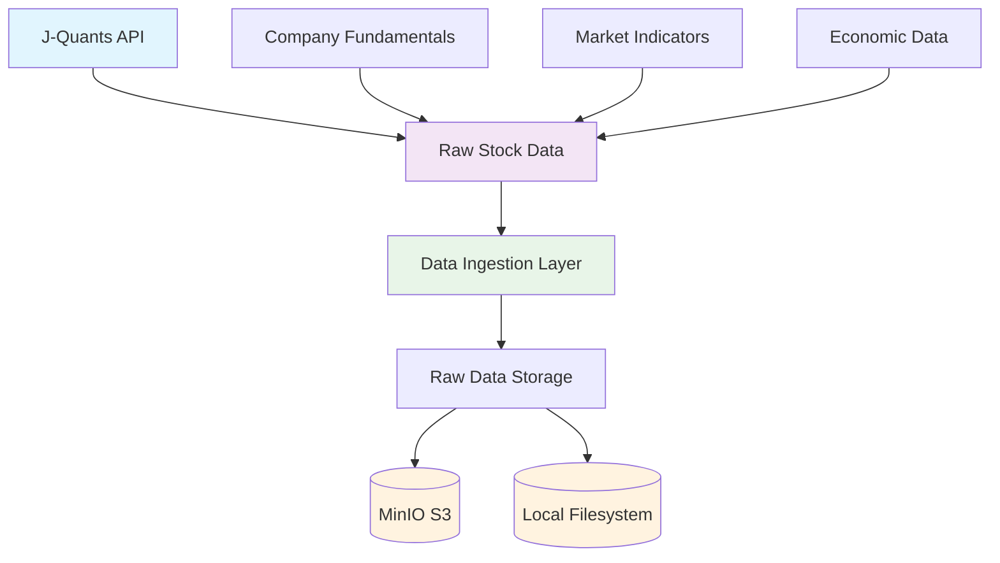

## Data Processing Pipeline

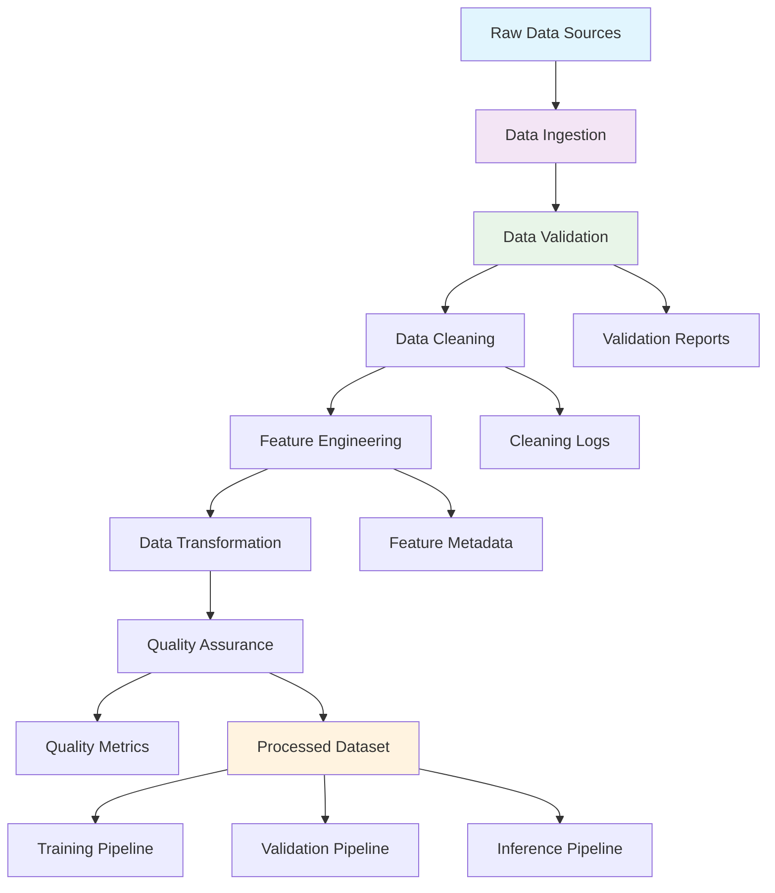

## Feature Engineering Data Flow

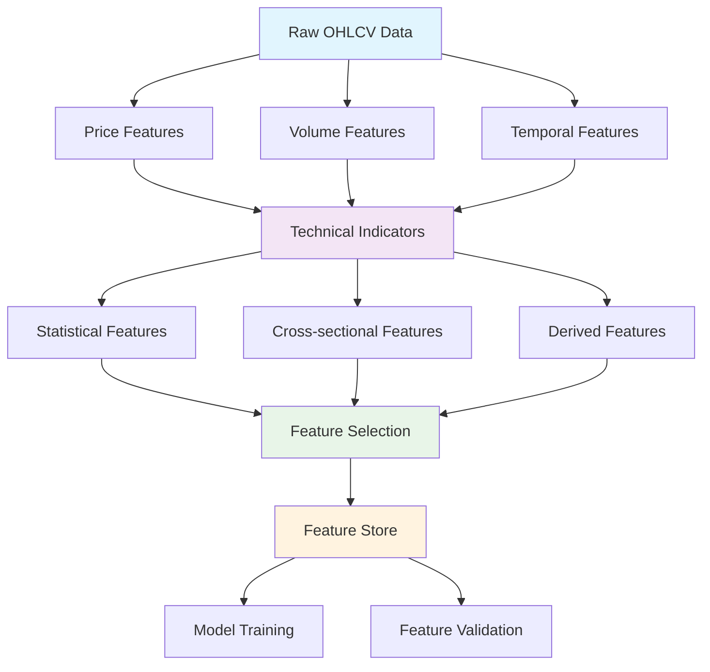

## ML Training Pipeline Data Flow

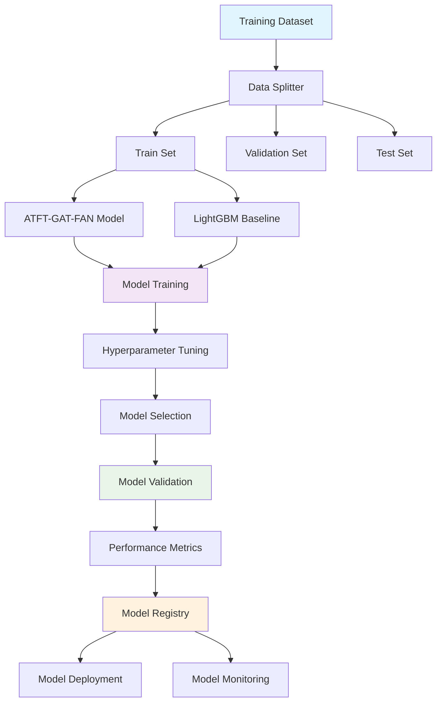

## Model Inference Data Flow

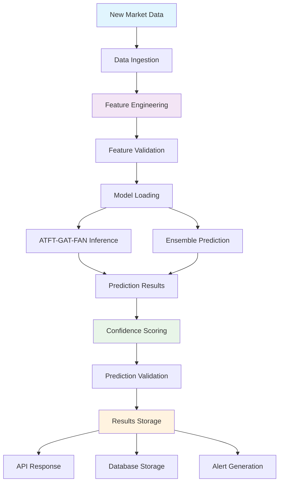

## Data Quality Pipeline

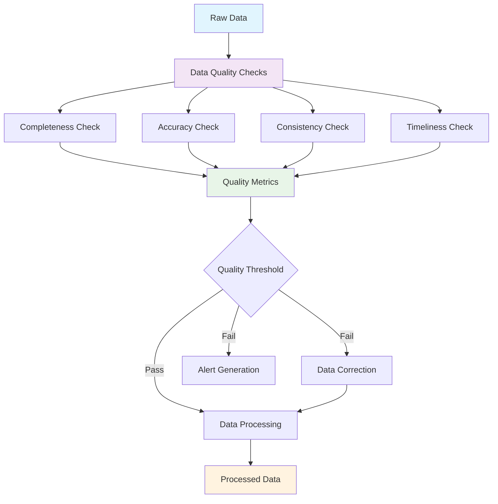

## Storage Layer Architecture

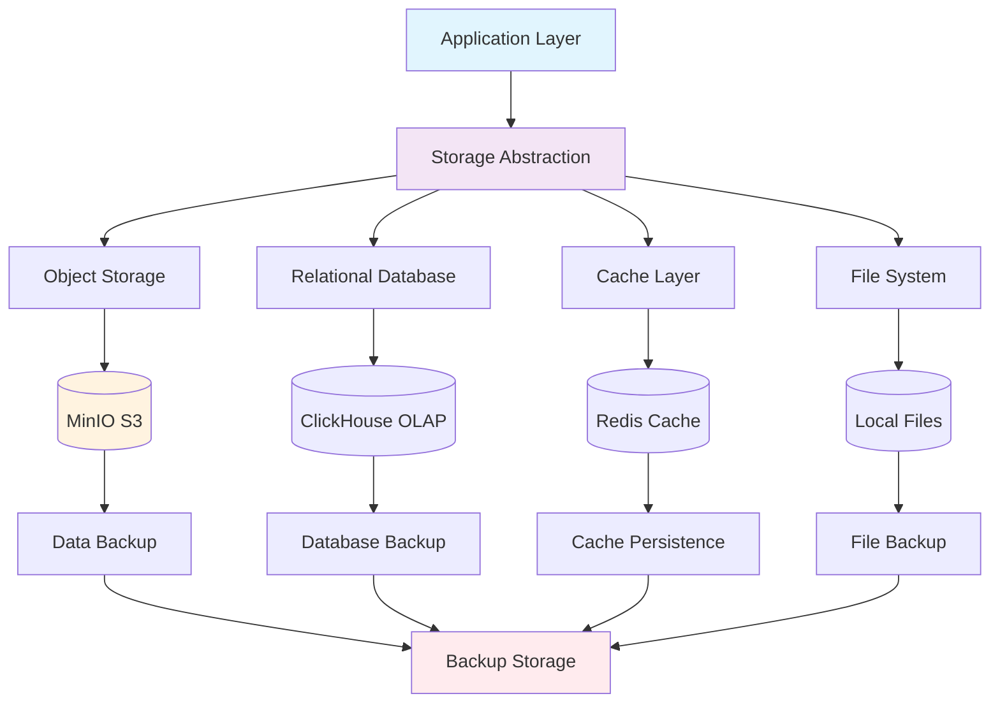

## Monitoring & Observability Data Flow

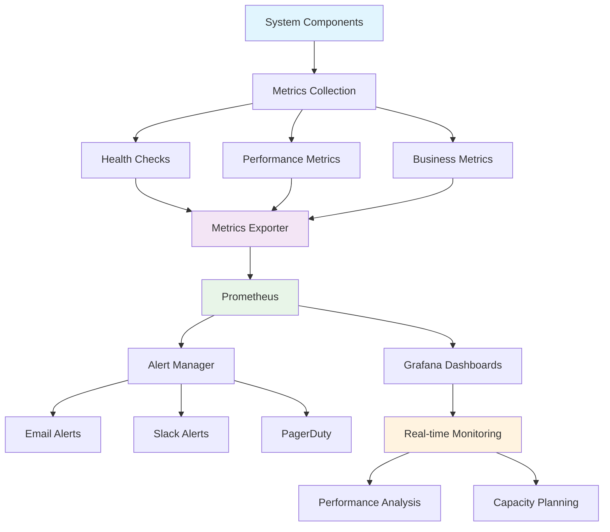

## Backup & Recovery Data Flow

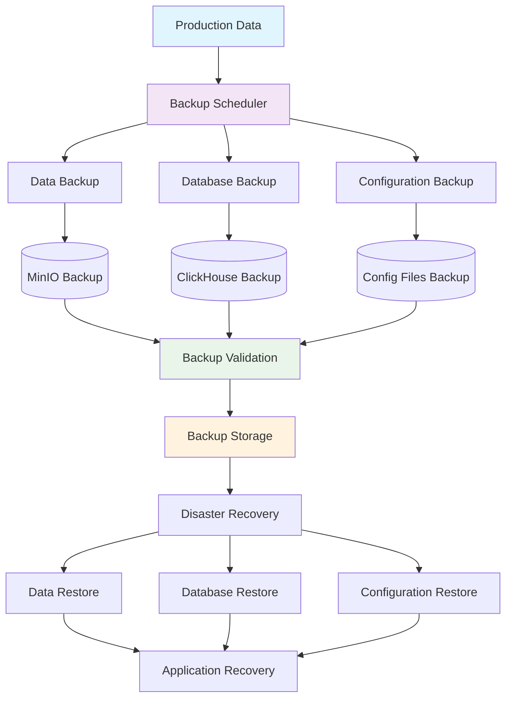

## Data Lineage Tracking

### End-to-End Data Traceability

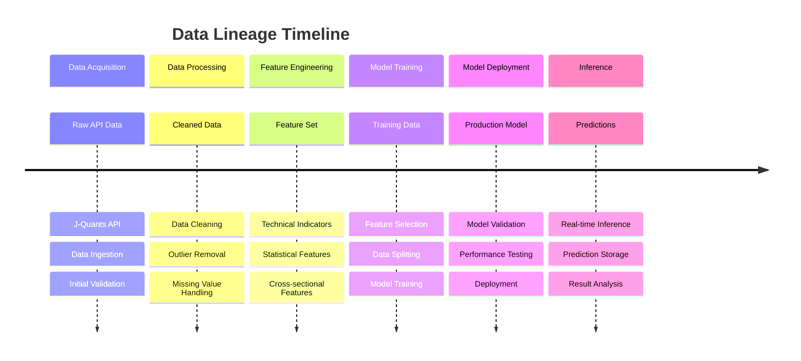

## Data Quality Gates

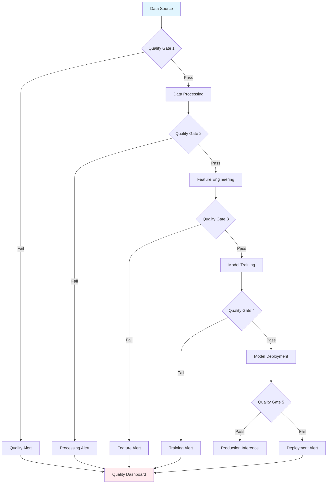

## Performance Monitoring Data Flow

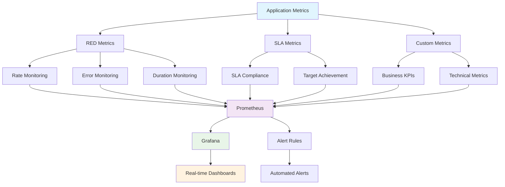

## Security Data Flow

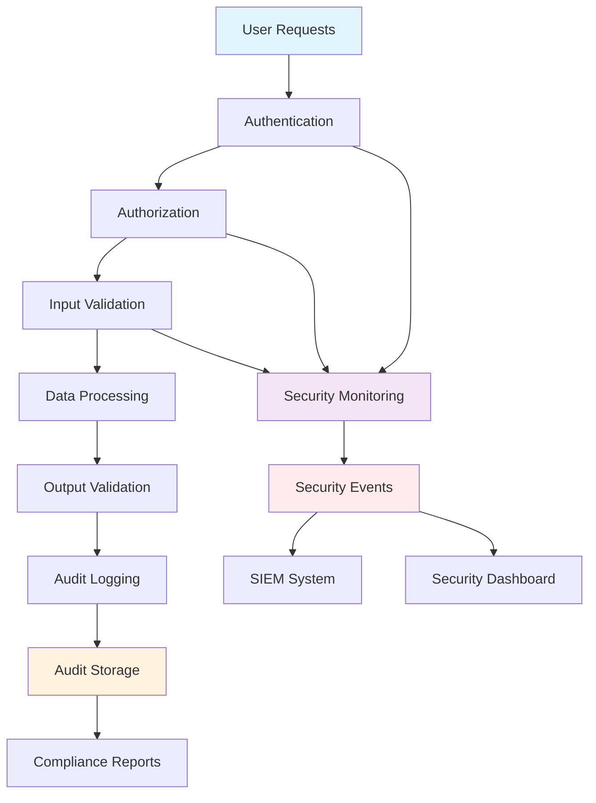

## Integration Points

### External System Integration

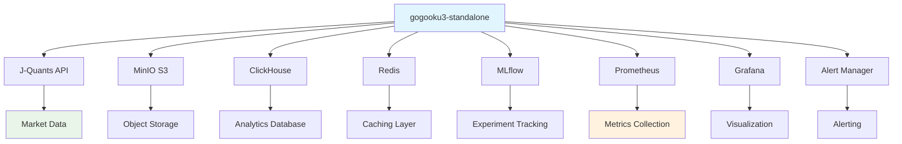

## Data Retention Policies

| Data Type | Retention Period | Storage Location | Backup Frequency |
|-----------|-----------------|------------------|------------------|
| Raw Market Data | 7 years | MinIO S3 | Daily |
| Processed Features | 2 years | MinIO S3 | Daily |
| Model Artifacts | 1 year | MLflow Registry | Weekly |
| Training Metrics | 6 months | ClickHouse | Daily |
| Prediction Results | 1 year | ClickHouse | Daily |
| Audit Logs | 3 years | MinIO S3 | Daily |
| System Logs | 90 days | Local Filesystem | Daily |
| Performance Metrics | 1 year | Prometheus | Continuous |

## Data Classification

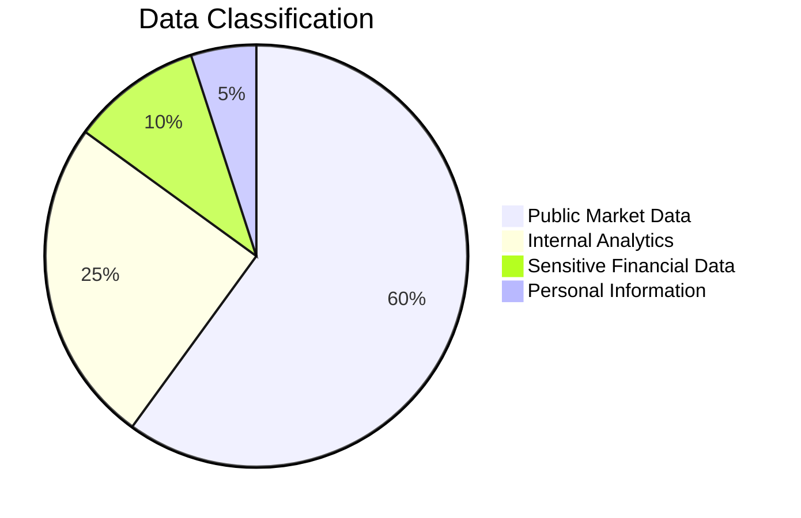

## Compliance & Governance

### Data Governance Framework

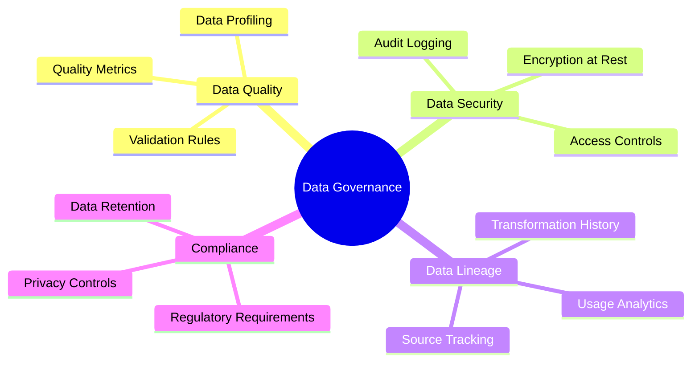

---

## Implementation Details

### Data Flow Implementation

```python
# Example data flow implementation
from typing import Dict, Any, List
import pandas as pd
from pathlib import Path

class DataFlowTracker:
    """Tracks data flow through the system."""

    def __init__(self):
        self.flow_steps = []
        self.metadata = {}

    def track_step(self, step_name: str, input_data: Any, output_data: Any, metadata: Dict[str, Any]):
        """Track a data processing step."""
        step_info = {
            'step_name': step_name,
            'timestamp': pd.Timestamp.now(),
            'input_shape': getattr(input_data, 'shape', None) if hasattr(input_data, 'shape') else None,
            'output_shape': getattr(output_data, 'shape', None) if hasattr(output_data, 'shape') else None,
            'metadata': metadata
        }
        self.flow_steps.append(step_info)

    def get_lineage_report(self) -> Dict[str, Any]:
        """Generate data lineage report."""
        return {
            'total_steps': len(self.flow_steps),
            'steps': self.flow_steps,
            'start_time': self.flow_steps[0]['timestamp'] if self.flow_steps else None,
            'end_time': self.flow_steps[-1]['timestamp'] if self.flow_steps else None,
            'duration': (self.flow_steps[-1]['timestamp'] - self.flow_steps[0]['timestamp']) if len(self.flow_steps) > 1 else None
        }
```

### Quality Gate Implementation

```python
# Example quality gate implementation
from data_quality.great_expectations_suite import DataQualityValidator

class QualityGate:
    """Implements data quality gates in the pipeline."""

    def __init__(self, quality_thresholds: Dict[str, float]):
        self.validator = DataQualityValidator()
        self.thresholds = quality_thresholds

    def check_quality(self, data: pd.DataFrame, stage: str) -> Dict[str, Any]:
        """Check data quality for a specific pipeline stage."""
        result = self.validator.validate_dataset(data, f"{stage}_validation")

        # Apply stage-specific thresholds
        gate_passed = (
            result.passed and
            result.details.get('completeness', {}).get('overall_missing_ratio', 1.0) <= self.thresholds.get('missing_ratio', 0.05) and
            result.details.get('uniqueness', {}).get('duplicate_ratio', 1.0) <= self.thresholds.get('duplicate_ratio', 0.01)
        )

        return {
            'gate_passed': gate_passed,
            'validation_result': result,
            'stage': stage,
            'recommendations': result.recommendations
        }
```

---

## Contact & Support

- **Data Architecture**: [Data Engineering Team]
- **Data Quality**: [Data Quality Team]
- **ML Engineering**: [ML Engineering Team]
- **DevOps/SRE**: [DevOps Team]

---

*Last Updated: 2024-01-XX*
*Version: 2.0.0*
*Document Owner: Data Engineering Team*
