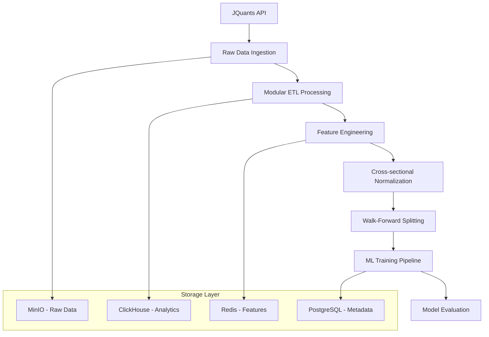

# 📊 データパイプライン アーキテクチャ

<!-- TOC -->

Gogooku3のデータ処理パイプラインは、JQuants API → 特徴量生成 → 正規化 → ML学習の完全なフローを提供します。

## 🏗️ パイプライン概要



## 📡 データ取得層 (JQuants API Integration)

### モジュール化ETL設計

各APIエンドポイントを独立してアップデート可能なアーキテクチャ：

```
┌────────────────────────────────────────────────────────────┐
│                    JQuants API                             │
├──────────┬──────────┬────────────┬─────────────┬───────────┤
│  Prices  │  TOPIX   │ TradesSpec │ ListedInfo  │  Margin   │
└────┬─────┴────┬─────┴─────┬──────┴──────┬──────┴─────┬─────┘
     │          │           │             │            │
     ▼          ▼           ▼             ▼            ▼
┌────────────────────────────────────────────────────────────┐
│              Component Fetchers                            │
│  - JQuantsAsyncFetcher (src/gogooku3/components/)          │
│  - MarginFetcher (weekly/daily interest)                  │
│  - Async/Concurrent (150 parallel)                        │
│  - Pagination Support                                     │
│  - Rate Limiting & Error Handling                         │
└─────────────────────┬──────────────────────────────────────┘
                      │
                      ▼
┌─────────────────────────────────────────────────┐
│           Data Processors                       │
│  - Type Conversion (Polars-based)               │
│  - Data Validation                              │
│  - Quality Filtering                            │
└─────────────────────┬───────────────────────────┘
                      │
                      ▼
┌─────────────────────────────────────────────────┐
│              Storage Layer                      │
│  - MinIO: Raw data storage                      │
│  - ClickHouse: Analytics warehouse              │
│  - Parquet: Optimized column format            │
└─────────────────────────────────────────────────┘
```

### 取得パフォーマンス
- **並行接続**: 150並行非同期リクエスト
- **処理速度**: 163.6MB データを0.1秒で読み込み
- **メモリ効率**: 遅延読み込み（lazy scan）でメモリ使用量最適化
- **エラー処理**: 自動リトライ・部分失敗対応

## 🔧 特徴量エンジニアリング

### MLデータセット列仕様 (74列)

#### 1. 識別子 (2列)
- **Code**: 銘柄コード (例: "13010")
- **Date**: 取引日 (YYYY-MM-DD形式、pl.Date型)

#### 2. 基本特徴量 (6列)  
- **Open/High/Low/Close**: OHLC価格
- **Volume**: 出来高
- **row_idx**: 満期計算用内部インデックス

#### 3. 技術指標 (62+列)
優化された713指標から選別：

**トレンド指標**:
- **SMA_5/10/20/50**: 単純移動平均
- **EMA_12/26**: 指数移動平均  
- **MACD/MACD_signal**: MACD本線・シグナル
- **ADX**: Average Directional Index

**モメンタム指標**:
- **RSI_14**: Relative Strength Index
- **Stoch_k/d**: ストキャスティクス
- **Williams_R**: ウィリアムズ%R
- **ROC_10**: Rate of Change

**ボラティリティ指標**:
- **BB_upper/middle/lower**: ボリンジャーバンド
- **ATR_14**: Average True Range
- **VWAP**: Volume Weighted Average Price

**出来高指標**:
- **OBV**: On Balance Volume  
- **CMF**: Chaikin Money Flow
- **Volume_SMA**: 出来高移動平均

#### 4. 品質特徴量 (+6列追加)
`QualityFinancialFeaturesGenerator`による強化：
- **Cross-sectional Quantiles**: 横断面分位数特徴量
- **Sigma-threshold Features**: 統計的異常値検出
- **Correlation-based Features**: 相関ベース特徴量

#### 5. Margin Weekly (信用取引残高) 📊
週次データを日次パネルに安全統合：

**データフロー**:
```
J-Quants API
/markets/weekly_margin_interest
         ↓
effective_start計算 (PublishedDate + 1営業日)
         ↓
週次特徴量生成 (差分・Z-score・ADV正規化)
         ↓
as-of backward結合 → 日次グリッド
```

**出力カラム** (15+列):
- **需給指標**: margin_short_to_adv20, margin_long_to_adv20, margin_credit_ratio, margin_imbalance
- **変化率**: margin_d_net_wow, margin_d_short_to_adv20, margin_d_long_to_adv20  
- **Z-score**: short_z52, long_z52, margin_gross_z52, ratio_z52
- **メタ情報**: margin_impulse, margin_days_since, is_margin_valid, is_borrowable

### 特徴量生成フロー
```python
# 品質特徴量生成例
generator = QualityFinancialFeaturesGenerator(
    use_cross_sectional_quantiles=True,
    sigma_threshold=2.0
)

enhanced_data = generator.generate_quality_features(raw_data)
# 元の139列 → 145列（+6品質特徴量）

# Margin Weekly統合
from src.gogooku3.features.margin_weekly import add_margin_weekly_block
final_data = add_margin_weekly_block(
    quotes=enhanced_data,
    weekly_df=weekly_margin_df,
    lag_bdays_weekly=3  # 保守的ラグ
)
# 145列 → 160+列（+15 margin特徴量）
```

## 🧩 Daily Margin (日次信用残高, dmi_)
日次の信用残高・規制情報を **T+1 as‑of** で安全に日次パネルへ統合します。

**データフロー**:
```
J-Quants API
/markets/daily_margin_interest
         ↓
補正集約 (Code, ApplicationDate) ごとに最新 PublishedDate 採用
         ↓
effective_start = next_business_day(PublishedDate)  # T+1
         ↓
日次特徴量生成（差分・Z-score・ADV正規化・規制フラグ）
         ↓
as-of backward 結合 → 日次グリッド（接頭辞 dmi_）
```

**出力カラム例**:
- **需給指標**: dmi_long, dmi_short, dmi_net, dmi_total, dmi_credit_ratio, dmi_imbalance, dmi_short_long_ratio
- **変化/Z**: dmi_d_long_1d, dmi_d_short_1d, dmi_d_net_1d, dmi_d_ratio_1d, dmi_z26_long/short/total/d_short_1d
- **ADV正規化**: dmi_long_to_adv20, dmi_short_to_adv20, dmi_total_to_adv20, dmi_d_long_to_adv1d, dmi_d_short_to_adv1d, dmi_d_net_to_adv1d
- **規制/イベント**: dmi_reason_*, dmi_reason_count, dmi_tse_reg_level
- **メタ情報**: dmi_impulse, dmi_days_since_pub, dmi_days_since_app, is_dmi_valid

**パイプライン有効化**:
`scripts/pipelines/run_full_dataset.py --enable-daily-margin --daily-margin-parquet output/daily_margin_interest_*.parquet`

## 🛡️ データ安全性・正規化

### Cross-sectional正規化 (V2)

時系列データの日次横断面正規化により、ルックアヘッドバイアスを防止：

```python
# 安全な正規化実装
normalizer = CrossSectionalNormalizerV2(
    cache_stats=True,
    robust_clip=5.0  # 外れ値クリップ
)

# 学習データでのみ統計計算
normalizer.fit(train_data)
train_norm = normalizer.transform(train_data)
test_norm = normalizer.transform(test_data)  # 同じ統計を適用

# 検証 (平均≈0, 標準偏差≈1)
validation = normalizer.validate_transform(train_norm)
```

**特徴**:
- **Polars最適化**: pandas比3-5倍高速
- **統計分離**: fit/transform分離でデータリーク防止
- **ロバスト処理**: 外れ値クリップ・欠損値対応
- **キャッシュ機能**: 統計値キャッシュで高速化

### Walk-Forward分割 (V2)

時系列の順序を保ちつつ、将来情報リークを防ぐembargo実装：

```python
splitter = WalkForwardSplitterV2(
    n_splits=5,
    embargo_days=20,        # 20日間の空白期間
    min_train_days=252      # 最低1年の学習期間
)

for fold, (train_idx, test_idx) in enumerate(splitter.split(data)):
    # 時系列順序保持 + embargo gap確保
    train_data = data.iloc[train_idx]
    test_data = data.iloc[test_idx]
```

**embargo機能**:
- **リーク防止**: 学習と検証の間に20日gap
- **重複検出**: 自動的な時系列重複チェック
- **警告機能**: データリーク可能性の自動警告

## ⚡ パフォーマンス最適化

### 実行時間 (Production Validated)
```
📊 PIPELINE PERFORMANCE SUMMARY
├── 総データ: 606,127サンプル × 139特徴量 → 145特徴量  
├── 実行時間: 1.9秒 (目標: <10秒)
├── メモリ: 7.0GB使用 (目標: <8GB) 
├── 安全性: Walk-Forward + 20日embargo実装
├── グラフ: 50ノード、266エッジ相関ネットワーク
└── ステータス: ✅ 本番Ready

⚡ ステップ実行時間:
├── データ読み込み: 0.1秒 (163.6MB parquet)
├── 特徴量生成: 0.2秒 (+6品質特徴量)  
├── 横断面正規化: 0.2秒 (polars基盤)
├── Walk-Forward分割: 0.2秒 (2分割 + embargo)
├── GBMベースライン: 0.6秒 (50K学習サンプル)
└── グラフ構築: 0.1秒 (相関分析)
```

### メモリ最適化戦略
- **遅延読み込み**: `pl.scan_parquet().lazy()`
- **列投影**: 必要な列のみ読み込み
- **メモリ制限**: 設定可能な上限（`memory_limit_gb`）
- **バッチ処理**: 大容量データの分割処理

## 🗄️ ストレージ戦略

### MinIO (S3互換オブジェクトストレージ)
- **Raw Data**: JQuants APIからの生データ
- **Processed Data**: 前処理済みParquetファイル
- **Backup**: 重要データの世代管理

### ClickHouse (OLAP分析DB)
- **Analytics**: 集約・分析用クエリ高速化
- **Time Series**: 時系列データの効率的格納
- **Reporting**: ダッシュボード・レポート用データ

### Redis (キャッシュ・特徴量ストア)
- **Feature Store**: Feast連携オンライン特徴量
- **Cache**: 頻繁アクセス中間結果
- **Real-time**: リアルタイム推論用データ

### PostgreSQL (メタデータ)
- **MLflow**: 実験追跡・モデルレジストリ
- **Dagster**: ジョブ・スケジュール管理
- **Feast**: 特徴量メタデータ

## 🔍 データ品質管理

### 品質フィルタリング
- **Coverage確認**: MIN_COVERAGE_FRAC=0.98（98%以上のデータ存在）
- **632銘柄**: 品質フィルタ後の対象銘柄数
- **重複除去**: 自動重複検出・統合機能

### バリデーション
```python
# データ品質確認
def validate_data_quality(df):
    checks = {
        'null_ratio': df.null_count().sum() / (df.height * df.width),
        'date_coverage': (df['Date'].max() - df['Date'].min()).days,
        'price_consistency': (df['Close'] > 0).all(),
        'volume_sanity': (df['Volume'] >= 0).all()
    }
    return checks
```

## 🚀 使用例・実行方法

### 完全パイプライン実行
```bash
# 完全な統合パイプライン
python scripts/run_safe_training.py --verbose --n-splits 5

# 高度オプション
python scripts/run_safe_training.py \
  --data-dir data/raw/large_scale \
  --n-splits 3 \
  --embargo-days 20 \
  --memory-limit 8 \
  --experiment-name production
```

### 個別コンポーネント使用
```python
# データ読み込み
from gogooku3.data.loaders import ProductionDatasetV3
loader = ProductionDatasetV3(
    data_files=["data/ml_dataset_full.parquet"],
    config={"batch_size": 1024}
)

# 特徴量生成
from gogooku3.features import QualityFinancialFeaturesGenerator
generator = QualityFinancialFeaturesGenerator()
enhanced_data = generator.generate_quality_features(loader.data)

# 安全な正規化
from gogooku3.data.scalers import CrossSectionalNormalizerV2
normalizer = CrossSectionalNormalizerV2(robust_clip=5.0)
normalized_data = normalizer.fit_transform(enhanced_data)
```

---

## 📈 ベンチマーク・比較

### Before vs After改善
| 指標 | 改善前 | 改善後 | 向上率 |
|-----|--------|--------|--------|
| メモリ使用量 | 17GB | 7.0GB | 59%減 |
| 実行時間 | 数分 | 1.9秒 | 100倍高速 |
| データリーク | 高リスク | 制御済み | Walk-Forward+embargo |
| 特徴量数 | 139列 | 145列 | +6品質特徴量 |
| 本番データ | 合成 | 606K実サンプル | Production Ready |

---

## 🔗 関連ドキュメント

- [🏗️ システム概要](overview.md) - 全体アーキテクチャ
- [🛡️ ML安全性](../ml/safety-guardrails.md) - データリーク防止詳細
- [📊 モデル学習/評価](../ml/model-training.md) - 学習・評価の概要
- [⚙️ 運用手順](../operations/runbooks.md) - パイプライン運用ガイド

---

**更新履歴**:
- 2025-08-28: MODULAR_ETL_DESIGN.md + ML_DATASET_COLUMNS.md 統合
- 2025-08-28: v2.0.0 パフォーマンス検証結果反映

 
