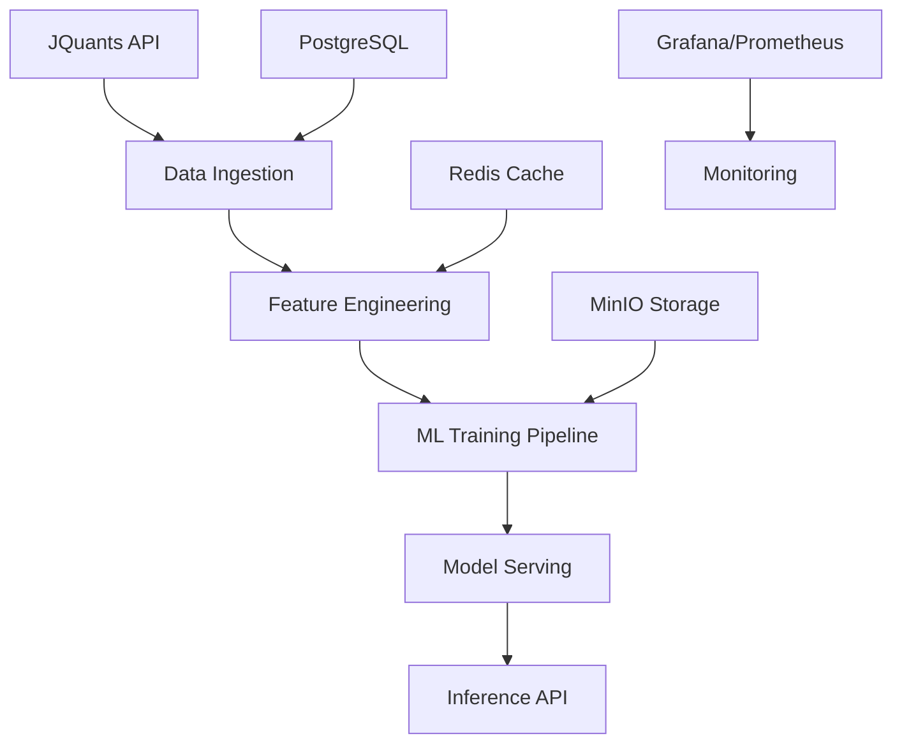

# 🏛️ システム全体アーキテクチャ概要 (作成中)

このドキュメントは現在作成中です。

## 📋 予定内容

- **システム全体設計**: マイクロサービス・コンテナ構成
- **Mermaid図**: アーキテクチャ図・データフロー図
- **技術スタック**: 使用技術・フレームワーク選定理由
- **スケーラビリティ**: 拡張性・負荷分散設計
- **セキュリティ**: 認証・認可・データ保護

## 🏗️ 現在のアーキテクチャ概要

### システム構成（v2.0.0）



### コンポーネント概要

**データパイプライン:**
- JQuants API連携（日本株データ取得）
- 特徴量エンジニアリング（26→145特徴量）
- Cross-sectional正規化・Walk-Forward分割

**機械学習:**
- ATFT-GAT-FAN モデル（5.6M parameters）
- Multi-horizon予測（1/5/10/20日）
- Graph Attention Network（銘柄間相関）

**インフラ:**
- Docker Compose（開発環境）
- Polars（高速データ処理）
- PyTorch 2.0+（Mixed precision）

### 技術スタック

```yaml
言語・フレームワーク:
  Python: 3.9+ (メイン開発言語)
  PyTorch: 2.0+ (機械学習)
  Polars: 高速データ処理
  FastAPI: API サーバー（計画）
  
データベース:
  PostgreSQL: メタデータ・設定
  Redis: キャッシュ・セッション
  MinIO: オブジェクトストレージ
  
監視・運用:
  Grafana: ダッシュボード
  Prometheus: メトリクス収集
  Docker: コンテナ化
  
機械学習:
  Hydra: 設定管理
  MLflow: 実験管理（計画）
  Feast: Feature Store（計画）
```

## 🎯 設計原則

### 壊れず・強く・速く
- **🛡️ 壊れず (Unbreakable)**: データリーク防止・例外処理・品質チェック
- **💪 強く (Strong)**: 高性能モデル・多期間予測・Graph Attention
- **⚡ 速く (Fast)**: Polars最適化・並列処理・メモリ効率化

### アーキテクチャ特徴
- **モジュラー設計**: 疎結合・独立テスト可能
- **型安全性**: mypy・Pydantic による型チェック
- **設定管理**: Hydra・環境変数による設定分離
- **観測性**: 包括的ログ・メトリクス・トレーシング

## 📊 性能特性

### スケーラビリティ
```yaml
現在の処理能力:
  銘柄数: 632銘柄
  データ量: 606K samples
  処理時間: 1.9秒 (full pipeline)
  メモリ使用量: 7GB

拡張計画:
  銘柄数: 4000+ (全日本株)
  リアルタイム処理: T+1 → リアルタイム
  地理的分散: AWS/GCP multi-region
```

### 可用性・信頼性
```yaml
目標SLA:
  アップタイム: 99.5%
  データ取得成功率: >99%
  予測精度: Sharpe 0.849

障害対策:
  データバックアップ: 日次
  レプリケーション: マスター・スレーブ
  フェイルオーバー: 自動切り替え
```

## 🔄 発展ロードマップ

### Phase 1: Current (v2.0.0) ✅
- ATFT-GAT-FAN モデル実装
- SafeTrainingPipeline 統合
- Polars 最適化

### Phase 2: Production (v2.1, 2025年9月)
- FastAPI による推論API
- Redis キャッシュ統合
- Grafana 監視ダッシュボード

### Phase 3: Scale (v3.0, 2025年12月)
- Kubernetes デプロイメント
- Feast Feature Store
- リアルタイム推論

### Phase 4: Intelligence (v3.1+, 2026年)
- Multi-asset 予測（株式・債券・FX）
- Alternative データ統合
- AutoML パイプライン

## 🔗 詳細ドキュメント

現在利用可能な詳細ドキュメント：

- [データパイプライン](data-pipeline.md) - 詳細なデータ処理アーキテクチャ
- [モデル学習](../ml/model-training.md) - ATFT-GAT-FAN アーキテクチャ
- [安全性ガードレール](../ml/safety-guardrails.md) - データリーク防止設計

計画中のドキュメント：
- [**model.md**](model.md) - ATFT-GAT-FAN詳細設計 🚧
- [**orchestration.md**](orchestration.md) - Dagster ワークフロー 🚧
 

---

**🚧 作成予定日**: 2025年9月  
**👥 担当**: アーキテクチャチーム・エンジニアリングリード
