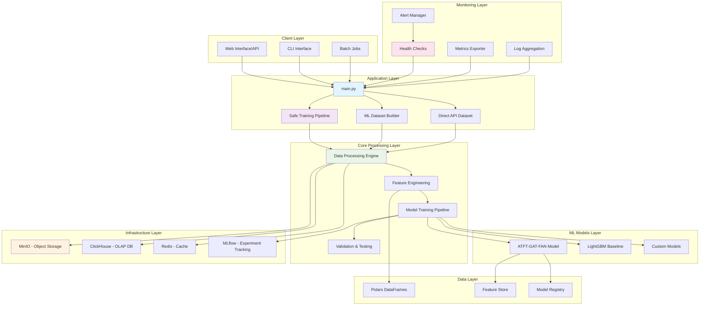
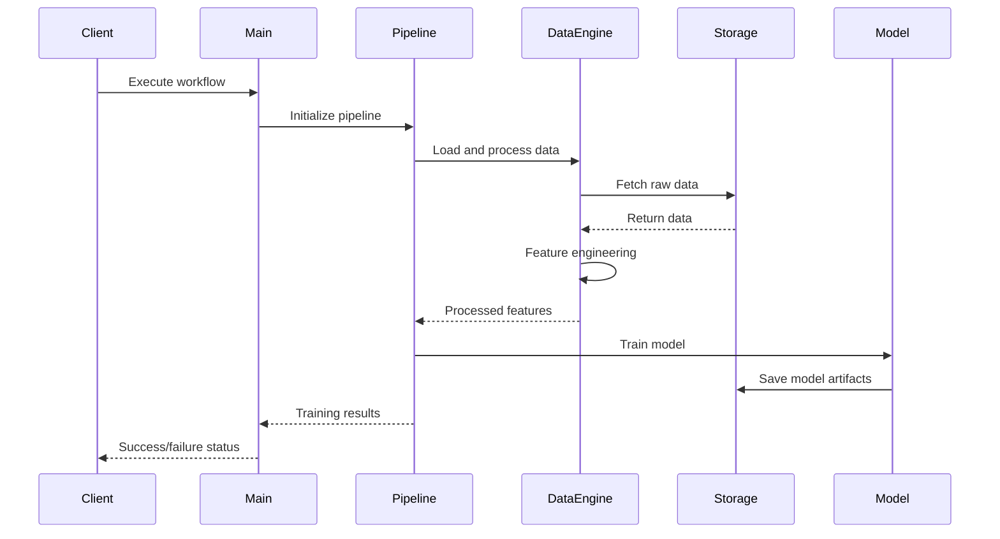
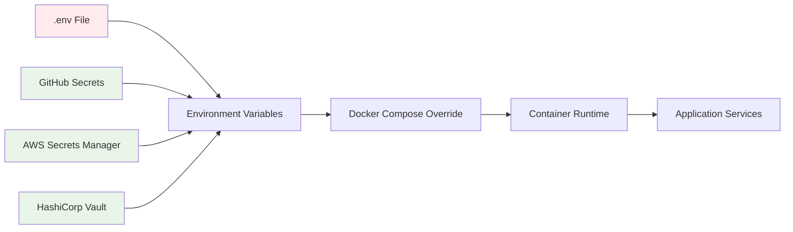
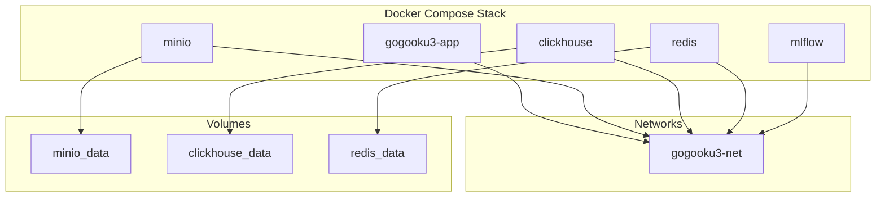

# 🏗️ gogooku3-standalone System Architecture

## Overview

gogooku3-standalone is a comprehensive machine learning system for Japanese stock market prediction, designed with the principles of "Unbreakable, Strong, and Fast" (壊れず・強く・速く).

## Core Principles

### 🛡️ Unbreakable (壊れず)
- **Robust Data Pipeline**: Comprehensive data validation and quality checks
- **Fault Tolerance**: Graceful error handling and recovery mechanisms
- **Security First**: Secure credential management and access controls
- **Monitoring**: Comprehensive health checks and alerting

### 💪 Strong (強く)
- **High-Performance ML**: ATFT-GAT-FAN model with 5.6M parameters
- **Advanced Features**: 155 technical and fundamental features
- **Quality Assurance**: Rigorous testing and validation pipelines
- **Scalable Architecture**: Modular design for easy extension

### ⚡ Fast (速く)
- **Polars Engine**: Lightning-fast data processing
- **Optimized Training**: Efficient GPU utilization and parallel processing
- **Streaming Pipeline**: Real-time data processing capabilities
- **Performance Monitoring**: Continuous optimization and benchmarking

## System Architecture

## Component Details

### Application Layer

#### Main Entry Point (`main.py`)
- **Purpose**: Unified command-line interface for all operations
- **Responsibilities**:
  - Parse command-line arguments
  - Route to appropriate workflows
  - Handle global configuration
  - Provide user feedback and progress reporting

#### Workflow Orchestrators
- **Safe Training Pipeline**: End-to-end ML training with safety checks
- **ML Dataset Builder**: Data preprocessing and feature engineering
- **Direct API Dataset**: Real-time data acquisition from J-Quants

### Core Processing Layer

#### Data Processing Engine
- **Technology**: Polars DataFrames
- **Capabilities**:
  - High-performance data loading and transformation
  - Memory-efficient processing of large datasets
  - Parallel processing and optimization
  - Streaming data pipelines (optional)

#### Feature Engineering
- **Features**: 155 technical and fundamental indicators
- **Categories**:
  - Price-based indicators (OHLCV)
  - Technical analysis (RSI, MACD, Bollinger Bands)
  - Statistical measures (volatility, correlation)
  - Fundamental data integration

#### Model Training Pipeline
- **Models**: ATFT-GAT-FAN, LightGBM, custom architectures
- **Capabilities**:
  - Automated hyperparameter tuning
  - Cross-validation and model selection
  - Performance monitoring and early stopping
  - Model serialization and deployment

### Infrastructure Layer

#### Storage Systems
- **MinIO**: S3-compatible object storage for data and models
- **ClickHouse**: High-performance analytical database
- **Redis**: In-memory caching and session management
- **MLflow**: Experiment tracking and model registry

#### Data Flow

## Security Architecture

### Credential Management

### Security Controls
- **Input Validation**: All user inputs validated and sanitized
- **Access Control**: Role-based access to system components
- **Encryption**: Data at rest and in transit encryption
- **Audit Logging**: Comprehensive security event logging
- **Vulnerability Scanning**: Automated security assessments

## Monitoring and Observability

### Health Checks
- **Liveness Probe**: Application responsiveness
- **Readiness Probe**: Service availability
- **Deep Health Check**: Comprehensive system validation

### Metrics Collection
- **System Metrics**: CPU, memory, disk, network usage
- **Application Metrics**: Request rates, error rates, latency
- **Business Metrics**: Training performance, prediction accuracy
- **Custom Metrics**: Domain-specific KPIs

### Logging Strategy
- **Structured Logging**: JSON format with consistent fields
- **Log Levels**: DEBUG, INFO, WARNING, ERROR, CRITICAL
- **Log Rotation**: Automated log file management
- **Centralized Logging**: Aggregated log analysis (future)

## Deployment Architecture

### Container Strategy

### Environment Configuration
- **Development**: Local development with minimal resources
- **Staging**: Full environment testing with production-like setup
- **Production**: Optimized for performance and reliability

## Performance Characteristics

### Benchmarks
- **Data Processing**: 605K rows × 169 columns in <30 seconds
- **Feature Engineering**: 155 features generated in <2 minutes
- **Model Training**: ATFT-GAT-FAN convergence in <45 minutes
- **Memory Usage**: <8GB peak during normal operations
- **Storage Efficiency**: 99%+ Polars utilization

### Scalability Considerations
- **Horizontal Scaling**: Multiple training workers
- **Vertical Scaling**: GPU optimization and memory management
- **Data Parallelism**: Distributed data processing
- **Model Parallelism**: Large model training support

## Future Architecture Evolution

### Planned Enhancements
1. **Microservices Migration**: Decompose monolithic application
2. **Event-Driven Architecture**: Asynchronous processing pipelines
3. **Kubernetes Orchestration**: Container orchestration at scale
4. **Multi-Cloud Deployment**: Hybrid cloud architecture
5. **Advanced Monitoring**: Distributed tracing and APM

### Technology Roadmap
- **Kubernetes**: Container orchestration
- **Kafka**: Event streaming platform
- **Elasticsearch**: Advanced log analytics
- **Prometheus/Grafana**: Enterprise monitoring stack
- **Istio**: Service mesh for microservices

## Operational Excellence

### DevOps Practices
- **Infrastructure as Code**: Terraform/Kubernetes manifests
- **GitOps**: Git-based deployment workflows
- **Automated Testing**: Comprehensive CI/CD pipelines
- **Security Automation**: Automated security scanning and remediation

### Compliance and Governance
- **Data Privacy**: GDPR and Japanese data protection compliance
- **Financial Regulations**: FSA compliance for financial systems
- **Audit Trails**: Complete audit logging for regulatory requirements
- **Risk Management**: Comprehensive risk assessment and mitigation

---

## Contact and Support

- **Architecture Decisions**: Refer to ADRs in `docs/arch/adr/`
- **Operational Runbook**: See `ops/runbook.md`
- **Security Guidelines**: Refer to `security/` directory
- **Performance Tuning**: Check benchmark results in CI/CD artifacts

---

*Last Updated: 2024-01-XX*
*Version: 2.0.0*
