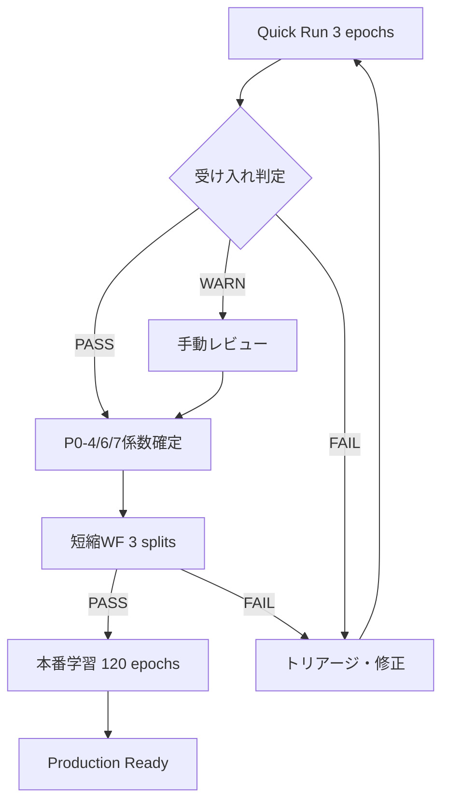

# P0 Complete - ドキュメント索引

**P0実装完了**: RFI-5/6回収 → P0-4/6/7有効化 → 本番学習 Ready ✅

**作成**: 2025-11-02
**ステータス**: Production Ready

---

## 🎯 クイックスタート（優先順）

| # | ドキュメント | 用途 | 所要時間 | 優先度 |
|---|-------------|------|----------|--------|
| 1 | **P0_QUICK_REFERENCE.md** | 1枚チートシート | 1分 | ⭐⭐⭐⭐⭐ |
| 2 | **P0_GO_NO_GO_EXECUTION_GUIDE.md** | 完全実行ガイド（20-40分で完了） | 5分 | ⭐⭐⭐⭐⭐ |
| 3 | **P0_3_EXECUTION_RECIPE.md** | P0-3 Quick Run実行手順 | 3分 | ⭐⭐⭐⭐⭐ |
| 4 | **P0_3_TRAIN_ATFT_PATCH.md** | train_atft.py RFI-5/6統合パッチ | 2分 | ⭐⭐⭐⭐⭐ |

---

## 📚 実装ドキュメント

### P0-3: GAT Gradient Flow

| ドキュメント | 内容 | 行数 | 優先度 |
|-------------|------|------|--------|
| `P0_3_COMPLETION_REPORT.md` | 完了報告・技術詳細 | 567行 | ⭐⭐⭐⭐ |
| `P0_3_FINAL_DELIVERABLES.md` | 成果物一覧 | 274行 | ⭐⭐⭐⭐ |
| `P0_3_PyG_ENVIRONMENT_SOLUTIONS.md` | PyG環境問題解決策 | 336行 | ⭐⭐⭐ |
| `P0_3_QUICK_START.md` | クイックガイド | 153行 | ⭐⭐⭐ |
| `P0_3_GAT_GRADIENT_FLOW_IMPLEMENTATION_GUIDE.md` | 技術実装ガイド | 205行 | ⭐⭐ |

### P0-4/6/7: Loss Rebalancing & Improvements

| ドキュメント | 内容 | 行数 | 優先度 |
|-------------|------|------|--------|
| `P0_4_6_7_COEFFICIENTS.md` | 初期係数設定ガイド | 548行 | ⭐⭐⭐⭐⭐ |

---

## 💻 実装ファイル

### コアコンポーネント

```
src/atft_gat_fan/models/components/
├── gat_fuse.py              (124行) - GATBlock + GatedFusion
├── gat_shim.py              (164行) - PyG-free fallback
└── gat_regularizer.py       (31行)  - Attention entropy

src/graph/
└── graph_utils.py           (56行)  - Edge standardization/dropout

src/gogooku3/utils/
└── rfi_metrics.py           (205行) - RFI-5/6メトリクス計算

src/losses/
├── quantile_crossing.py     (91行)  - P0-6 penalty
└── sharpe_loss_ema.py       (141行) - P0-7 EMA smoothing
```

### 設定ファイル

```
configs/atft/
├── gat/
│   └── default.yaml         - GAT設定（P0-3）
└── loss/
    └── p0467_initial.yaml   - P0-4/6/7係数

configs/atft/config_production_optimized.yaml  - 統合config
```

### スクリプト

```
scripts/
├── accept_quick_p03.py      (192行) - 受け入れテスト自動判定
├── diagnose_pyg_environment.py      - PyG環境診断
├── test_gat_shim_mode.py            - Shim動作確認
├── smoke_test_p0_3.py               - フルモデルテスト
└── smoke_test_p0_3_components.py    - コンポーネントテスト
```

---

## 🧪 テスト・検証

### 受け入れテスト（Go/No-Go）

```bash
# Quick Run (3 epochs)
USE_GAT_SHIM=1 BATCH_SIZE=1024 make train-quick EPOCHS=3 2>&1 | tee _logs/train_p03_quick.log

# RFI-5/6抽出
grep "RFI56 |" _logs/train_p03_quick.log > rfi_56_metrics.txt

# 自動判定
python scripts/accept_quick_p03.py rfi_56_metrics.txt
```

**判定基準**:
- ✅ PASS (exit code 0): すべてのチェック合格
- ⚠️ WARN (exit code 2): ボーダーライン（手動レビュー）
- ❌ FAIL (exit code 1): 重大な問題（修正必要）

### 短縮WF検証（3 splits）

```bash
# P0-4/6/7有効化
export QUANTILE_WEIGHT=1.0
export SHARPE_WEIGHT=0.30
export RANKIC_WEIGHT=0.20
export CS_IC_WEIGHT=0.15
export LAMBDA_QC=2e-3
export SHARPE_EMA_DECAY=0.95

# 短縮WF
USE_GAT_SHIM=1 BATCH_SIZE=1024 \
python scripts/train_atft.py --max-epochs 30 \
  --data-path output/ml_dataset_latest_full.parquet \
  2>&1 | tee _logs/train_p0467_wf3.log
```

**成功基準**:
- RankIC平均 > 0.05
- Sharpe > 0.3
- qx_rate < 0.05

---

## 📊 係数一覧（P0-4/6/7）

### 初期値（安全設定）

| 係数 | 値 | 用途 | 調整レンジ |
|------|-----|------|-----------|
| `QUANTILE_WEIGHT` | 1.0 | 基準損失 | 固定 |
| `SHARPE_WEIGHT` | 0.30 | P0-7 | 0.15-0.40 |
| `RANKIC_WEIGHT` | 0.20 | 順位相関 | 0.10-0.25 |
| `CS_IC_WEIGHT` | 0.15 | クロスセクション | 0.05-0.20 |
| `LAMBDA_QC` | 2e-3 | P0-6 | 2e-3 ~ 1e-2 |
| `SHARPE_EMA_DECAY` | 0.95 | P0-7 | 0.92-0.97 |
| `GAT_TAU` | 1.25 | Gate温度 | 1.0-2.0 |
| `GAT_EDGE_DROPOUT` | 0.05 | 正則化 | 0.03-0.15 |

### Phase-based Scheduling（オプション）

| Phase | Epochs | Sharpe | RankIC | CS-IC | 用途 |
|-------|--------|--------|--------|-------|------|
| 0-1 | 0-30 | 0.15 | 0.10 | 0.05 | 基礎学習 |
| 2-3 | 31-75 | 0.30 | 0.20 | 0.15 | 金融メトリクス重視 |
| 4 | 76-120 | 0.35 | 0.25 | 0.20 | ファインチューニング |

---

## 🚀 実行フロー

### 最短コース（20-40分）

```
1. Quick Run (15分)
   ↓
2. 受け入れ判定 (30秒)
   ↓ PASS
3. P0-4/6/7有効化 + 短縮WF (30分)
   ↓ PASS
4. 本番学習 (8-12時間)
```

### 詳細フロー



---

## 🎯 目標メトリクス

### Quick Run（3 epochs）

```yaml
gat_gate_mean: 0.2-0.7      # ✅ ゲート健全
deg_avg: 10-40              # ✅ グラフ接続性
isolates: < 0.02            # ✅ 孤立ノード少
RankIC: > 0                 # ✅ 正の相関（初期）
grad_ratio: 0.5-2.0         # ✅ 勾配バランス
qx_rate: < 0.05             # ✅ 交差少
```

### 短縮WF（3 splits, 30 epochs）

```yaml
RankIC_avg: > 0.05          # 順位相関確立
Sharpe_avg: > 0.3           # リスク調整リターン
qx_rate: < 0.05             # 分位点単調性
```

### 本番学習（120 epochs）

```yaml
Sharpe: > 0.849             # 目標達成
RankIC: > 0.18              # 高順位相関
qx_rate: < 0.03             # 高品質分位点
gat_gate_mean: 0.3-0.6      # 安定ゲート
```

---

## 🔧 トラブルシューティング

### よくある問題と解決策

| 問題 | 原因 | 解決策 | ドキュメント |
|------|------|--------|-------------|
| Segfault | PyG環境 | B-1案（PyTorch 2.8.0降格） | P0_3_PyG_ENVIRONMENT_SOLUTIONS.md |
| OOM | メモリ不足 | `BATCH_SIZE=512` | P0_GO_NO_GO_EXECUTION_GUIDE.md |
| RFI56ログ出ない | パッチ未適用 | train_atft.pyパッチ適用 | P0_3_TRAIN_ATFT_PATCH.md |
| Gate飽和 | tau小さい | `GAT_TAU=1.5-2.0` | P0_4_6_7_COEFFICIENTS.md |
| 交差多発 | ペナルティ弱 | `LAMBDA_QC=5e-3` | P0_4_6_7_COEFFICIENTS.md |
| RankIC負 | 初期不安定 | 正常（監視継続） | P0_GO_NO_GO_EXECUTION_GUIDE.md |

---

## 📁 ファイル構成

```
/workspace/gogooku3/
├── P0_COMPLETE_INDEX.md                    # 本ファイル
├── P0_QUICK_REFERENCE.md                   # 1枚チートシート
├── P0_GO_NO_GO_EXECUTION_GUIDE.md          # 完全実行ガイド
├── P0_4_6_7_COEFFICIENTS.md                # 係数設定詳細
│
├── P0_3_COMPLETION_REPORT.md               # P0-3完了報告
├── P0_3_EXECUTION_RECIPE.md                # P0-3実行レシピ
├── P0_3_TRAIN_ATFT_PATCH.md                # train_atft.pyパッチ
├── P0_3_FINAL_DELIVERABLES.md              # 成果物一覧
├── P0_3_PyG_ENVIRONMENT_SOLUTIONS.md       # 環境問題解決
├── P0_3_QUICK_START.md                     # クイックガイド
├── P0_3_GAT_GRADIENT_FLOW_IMPLEMENTATION_GUIDE.md  # 技術詳細
│
├── src/
│   ├── atft_gat_fan/models/components/
│   │   ├── gat_fuse.py                     # GATBlock + Fusion
│   │   ├── gat_shim.py                     # PyG-free fallback
│   │   └── gat_regularizer.py              # Entropy penalty
│   ├── graph/
│   │   └── graph_utils.py                  # Edge utilities
│   ├── gogooku3/utils/
│   │   └── rfi_metrics.py                  # RFI-5/6計算
│   └── losses/
│       ├── quantile_crossing.py            # P0-6
│       └── sharpe_loss_ema.py              # P0-7
│
├── configs/atft/
│   ├── gat/default.yaml                    # GAT設定
│   ├── loss/p0467_initial.yaml             # P0-4/6/7係数
│   └── config_production_optimized.yaml    # 統合config
│
└── scripts/
    ├── accept_quick_p03.py                 # 受け入れテスト
    ├── diagnose_pyg_environment.py         # 環境診断
    ├── test_gat_shim_mode.py               # Shimテスト
    ├── smoke_test_p0_3.py                  # フルテスト
    └── smoke_test_p0_3_components.py       # コンポーネントテスト
```

---

## 🎓 学習パス

### 初回実行（初心者）

1. `P0_QUICK_REFERENCE.md` - 全体像把握（1分）
2. `P0_GO_NO_GO_EXECUTION_GUIDE.md` - 実行手順理解（5分）
3. Quick Run実行 → 受け入れ判定（20分）
4. 結果に応じて次ステップ

### 係数調整（中級者）

1. `P0_4_6_7_COEFFICIENTS.md` - 係数の意味理解
2. `rfi_56_metrics.txt` 分析
3. 短縮WFで検証
4. Phase-based scheduling適用

### 問題解決（上級者）

1. 該当ドキュメントのトラブルシューティング参照
2. `P0_3_COMPLETION_REPORT.md` の技術詳細
3. ソースコード直接確認
4. 環境診断スクリプト実行

---

## 📞 サポート

### 報告テンプレート

```markdown
## 実行結果報告

### 環境
- PyTorch: <version>
- CUDA: <version>
- GPU: <model>
- Git commit: <hash>

### Quick Run結果
- Status: PASS/WARN/FAIL
- rfi_56_metrics.txt: (貼り付け)
- accept_quick_p03.py output: (貼り付け)

### 問題（該当時のみ）
- エラーメッセージ: (貼り付け)
- 最後の100行ログ: (貼り付け)

### 次のステップ
- [ ] 短縮WF実行
- [ ] 本番学習実行
- [ ] 問題修正・再実行
```

---

## 🗂 バージョン履歴

| バージョン | 日付 | 変更内容 |
|-----------|------|---------|
| 1.0.0 | 2025-11-02 | P0完全実装完了、RFI-5/6回収準備完了 |

---

**作成**: 2025-11-02
**最終更新**: 2025-11-02
**ステータス**: Production Ready ✅
