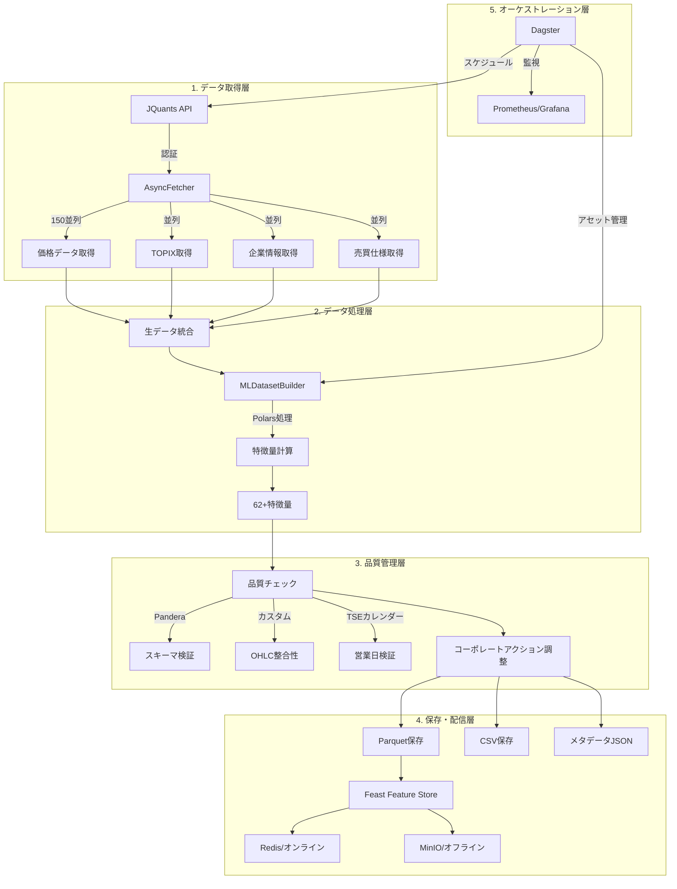

# gogooku3 データ処理フロー詳細

## 📊 概要

gogooku3は、日本株式市場のMLデータセットを構築するための包括的なデータパイプラインシステムです。JQuants APIからリアルタイムデータを取得し、62以上の特徴量を計算、品質チェックを経て、MLモデル学習用のデータセットを生成します。

## 🔄 処理フロー全体図



## 📋 各フェーズの詳細

### 1️⃣ データ取得フェーズ

#### 概要
JQuants APIから非同期並列処理で市場データを高速取得します。

#### 実装ファイル
- `scripts/pipelines/run_pipeline.py`
- `scripts/components/modular_updater.py`

#### 実行コマンド
```bash
# 完全実行
python scripts/pipelines/run_pipeline.py

# 部分実行（TOPIXのみ）
python scripts/components/modular_updater.py --update topix --from-date 2024-01-01
```

#### 処理詳細

##### 1.1 認証処理
```python
# JQuants API認証フロー
1. メールアドレス/パスワードでログイン
2. リフレッシュトークン取得
3. IDトークン取得（有効期限24時間）
4. 全APIリクエストにBearer認証ヘッダー付与
```

##### 1.2 データエンドポイント

| エンドポイント | 内容 | 並列度 | レート制限 |
|-------------|------|--------|----------|
| `/prices/daily_quotes` | 日次価格データ（OHLCV） | 150 | 300req/min |
| `/indices/topix` | TOPIX指数データ | 10 | 60req/min |
| `/listed/info` | 上場企業情報 | 1 | - |
| `/markets/trades_spec` | 売買仕様 | 10 | 60req/min |

##### 1.3 取得データ形式
```json
{
  "daily_quotes": [{
    "Code": "7203",
    "Date": "2024-01-04",
    "Open": 2500.0,
    "High": 2550.0,
    "Low": 2490.0,
    "Close": 2530.0,
    "Volume": 1000000,
    "TurnoverValue": 2530000000
  }]
}
```

### 2️⃣ 特徴量計算フェーズ

#### 概要
Polarsによる高速並列処理で62種類の技術的特徴量を計算します。

#### 実装ファイル
- `scripts/core/ml_dataset_builder.py`

#### 特徴量カテゴリ

##### 2.1 価格リターン特徴量（8個）
```python
# 単純リターン
returns_1d = (Close / Close.shift(1) - 1)
returns_5d = (Close / Close.shift(5) - 1)
returns_20d = (Close / Close.shift(20) - 1)
returns_60d = (Close / Close.shift(60) - 1)

# 対数リターン
log_returns_1d = log(Close / Close.shift(1))
log_returns_5d = log(Close / Close.shift(5))
log_returns_20d = log(Close / Close.shift(20))
log_returns_60d = log(Close / Close.shift(60))
```

##### 2.2 ボラティリティ特徴量（6個）
```python
# 歴史的ボラティリティ
volatility_20d = returns_1d.rolling(20).std()
volatility_60d = returns_1d.rolling(60).std()

# 実現ボラティリティ
realized_volatility_5d = sqrt(sum(returns_1d^2, 5))

# Parkinson推定量
parkinson_vol_20d = sqrt(1/(4*ln(2)) * rolling_mean((ln(High/Low))^2, 20))

# ボラティリティ比率
vol_ratio_20_60 = volatility_20d / volatility_60d
```

##### 2.3 技術指標（20個）
```python
# トレンド系
ema_10 = EMA(Close, 10)
ema_20 = EMA(Close, 20)
ema_60 = EMA(Close, 60)
sma_20 = SMA(Close, 20)
sma_60 = SMA(Close, 60)

# モメンタム系
rsi_14 = RSI(Close, 14)
macd = MACD(Close, 12, 26, 9)
macd_signal = MACD_signal(Close)
macd_histogram = MACD_histogram(Close)

# ボリンジャーバンド
bb_upper = BB_upper(Close, 20, 2)
bb_middle = BB_middle(Close, 20)
bb_lower = BB_lower(Close, 20)
bb_pct_b = (Close - bb_lower) / (bb_upper - bb_lower)
bb_width = (bb_upper - bb_lower) / bb_middle
```

##### 2.4 出来高特徴量（10個）
```python
# 出来高移動平均
volume_ma_20 = SMA(Volume, 20)
volume_ma_60 = SMA(Volume, 60)

# 出来高比率
volume_ratio = Volume / volume_ma_20
dollar_volume = Close * Volume
adv_20 = SMA(dollar_volume, 20)

# VWAP関連
vwap = sum(Close * Volume) / sum(Volume)
vwap_deviation = (Close - vwap) / vwap
```

##### 2.5 TOPIX相対特徴量（7個）
```python
# アルファ（超過リターン）
alpha_1d_topix = returns_1d - topix_returns_1d
alpha_5d_topix = returns_5d - topix_returns_5d
alpha_20d_topix = returns_20d - topix_returns_20d

# ベータ（市場感応度）
beta_60d = cov(returns_1d, topix_returns_1d) / var(topix_returns_1d)

# 相対強度
relative_strength_1d = returns_1d / topix_returns_1d
relative_strength_5d = returns_5d / topix_returns_5d
relative_strength_20d = returns_20d / topix_returns_20d
```

##### 2.6 マイクロストラクチャ特徴量（11個）
```python
# 価格レンジ
high_low_ratio = High / Low
daily_range = (High - Low) / Close
true_range = max(High - Low, abs(High - prev_Close), abs(Low - prev_Close))
atr_14 = ATR(14)

# ギャップ
gap_open = (Open - prev_Close) / prev_Close
gap_close = (Close - Open) / Open

# 日中パターン
intraday_momentum = (Close - Open) / Open
upper_shadow = (High - max(Open, Close)) / (High - Low)
lower_shadow = (min(Open, Close) - Low) / (High - Low)
```

### 3️⃣ データ品質管理フェーズ

#### 概要
複数層の品質チェックにより、データの整合性と信頼性を保証します。

#### 実装ファイル
- `scripts/quality/price_checks.py`
- `scripts/calendar/tse_calendar.py`
- `scripts/corporate_actions/adjust.py`

#### 品質チェック項目

##### 3.1 スキーマ検証（Pandera）
```python
schema = DataFrameSchema({
    "Code": Column(str, Check.str_matches(r"^\d{4}$")),
    "Date": Column(datetime, Check.not_null()),
    "Open": Column(float, Check.gt(0)),
    "High": Column(float, Check.gt(0)),
    "Low": Column(float, Check.gt(0)),
    "Close": Column(float, Check.gt(0)),
    "Volume": Column(int, Check.ge(0))
})
```

##### 3.2 ビジネスルール検証
```python
# OHLC整合性
assert High >= max(Open, Low, Close)
assert Low <= min(Open, High, Close)

# 価格変動制限（ストップ高・安考慮）
assert abs(daily_return) <= 0.3  # 30%制限

# 重複レコード
assert no_duplicates(Code, Date)
```

##### 3.3 TSEカレンダー検証
```python
# 営業日チェック
- 土日除外
- 祝日除外（日本の祝日）
- 年末年始休場（12/31-1/3）
- 臨時休場日対応
```

##### 3.4 コーポレートアクション調整
```python
# 株式分割調整
if split_ratio == 5:  # 5:1分割
    historical_price = historical_price / 5
    historical_volume = historical_volume * 5

# 配当落ち調整
adjusted_close = close - dividend_amount
```

### 4️⃣ 保存・配信フェーズ

#### 概要
複数形式でのデータ保存と、Feature Storeへの配信を行います。

#### 出力形式

##### 4.1 Parquet形式（推奨）
```python
# 高圧縮・高速読み込み
df.write_parquet("output/ml_dataset.parquet")
# サイズ: 約100MB（1年分、1000銘柄）
# 読込速度: < 1秒
```

##### 4.2 CSV形式（互換性）
```python
# Excel等での確認用
df.write_csv("output/ml_dataset.csv")
# サイズ: 約500MB（圧縮なし）
```

##### 4.3 メタデータJSON
```json
{
  "created_at": "2024-01-27T10:00:00",
  "shape": [365000, 65],
  "features": {
    "price": 6,
    "returns": 8,
    "volatility": 6,
    "technical": 20,
    "volume": 10,
    "topix_relative": 7,
    "microstructure": 11
  },
  "date_range": {
    "start": "2023-01-04",
    "end": "2024-01-26"
  },
  "quality_checks": {
    "schema_valid": true,
    "ohlc_valid": true,
    "duplicates": 0,
    "null_ratio": 0.001
  }
}
```

##### 4.4 Feature Store統合
```python
# Feast Feature Store
store = FeatureStore()

# オフラインストア（MinIO/S3）
store.materialize_incremental(end_date=datetime.now())

# オンラインストア（Redis）
store.push("price_features", df)
```

### 5️⃣ オーケストレーション層

#### 概要
Dagsterによるアセットベースのパイプライン管理とスケジューリングを提供します。

#### 実装ファイル
- `scripts/orchestration/assets.py`
- `scripts/orchestration/schedules.py`
- `scripts/orchestration/sensors.py`

#### アセット定義
```python
@asset(
    partitions_def=daily_partition,
    freshness_policy=FreshnessPolicy(maximum_lag_minutes=60*24)
)
def price_data_asset(context):
    """日次価格データアセット"""
    return fetch_prices()

@asset
def ml_dataset_asset(price_data, topix_data):
    """ML特徴量データセット"""
    return build_features(price_data, topix_data)
```

#### スケジュール
| スケジュール名 | 実行時刻 | 頻度 | 内容 |
|-------------|---------|------|------|
| daily_pipeline | 19:00 JST | 平日毎日 | 日次データ更新 |
| weekly_ml_training | 日曜 02:00 | 週次 | MLモデル学習 |
| feature_sync | 20:00 JST | 平日毎日 | Feature Store同期 |

#### センサー（イベント駆動）
```python
@sensor
def data_arrival_sensor():
    """新規データ到着を検知"""
    if new_data_available():
        return RunRequest()

@asset_sensor
def quality_alert_sensor():
    """品質問題を検知"""
    if error_rate > 0.05:
        return RunRequest(tags={"priority": "high"})
```

## 🔀 部分実行パターン

### パターン1: 特定期間の更新
```bash
python scripts/components/modular_updater.py \
  --update prices topix \
  --from-date 2024-01-01 \
  --to-date 2024-01-31
```

### パターン2: 特定銘柄の更新
```bash
python scripts/components/modular_updater.py \
  --update prices \
  --codes 7203 9984 6758 \
  --days 30
```

### パターン3: 既存データセットへの追加
```bash
python scripts/components/modular_updater.py \
  --dataset output/ml_dataset.parquet \
  --update topix \
  --tag topix_added
```

### パターン4: サンプルデータでのテスト
```bash
python scripts/pipelines/run_pipeline.py --sample
```

## ⚡ パフォーマンス特性

### 処理速度
| 処理 | スループット | 並列度 |
|-----|-------------|--------|
| API取得 | 150req/秒 | 150接続 |
| 特徴量計算 | 14,000行/秒 | 24ワーカー |
| 品質チェック | 50,000行/秒 | シングル |
| ファイル保存 | 100MB/秒 | - |

### リソース使用量
| リソース | 使用量 | 備考 |
|---------|--------|------|
| CPU | 24コア | 並列処理時 |
| メモリ | 最大50GB | 1000銘柄×365日 |
| ディスク | 1GB/年 | Parquet圧縮 |
| ネットワーク | 100Mbps | API取得時 |

### 実行時間目安
| データ規模 | 実行時間 | ボトルネック |
|-----------|---------|------------|
| 100銘柄×30日 | 5分 | API取得 |
| 1000銘柄×365日 | 30分 | 特徴量計算 |
| 全上場×1年 | 2時間 | メモリ |

## 🔍 トラブルシューティング

### よくある問題と対処法

#### 1. API認証エラー
```bash
# .envファイルを確認
cat .env | grep JQUANTS

# 認証情報を再設定
export JQUANTS_AUTH_EMAIL="your_email"
export JQUANTS_AUTH_PASSWORD="your_password"
```

#### 2. メモリ不足
```bash
# 並列度を下げる
export MAX_PARALLEL_WORKERS=10
export MAX_CONCURRENT_FETCH=50

# バッチサイズを小さくする
python scripts/pipelines/run_pipeline.py --batch-size 100
```

#### 3. APIレート制限
```bash
# 同時接続数を制限
export MAX_CONCURRENT_FETCH=50

# リトライ設定
export API_RETRY_COUNT=3
export API_RETRY_DELAY=5
```

#### 4. データ品質エラー
```python
# 品質チェックをスキップ（非推奨）
builder = MLDatasetBuilder(skip_quality_checks=True)

# 個別チェックの実行
from scripts.quality.price_checks import PriceDataValidator
validator = PriceDataValidator()
results = validator.validate_all(df)
print(results["errors"])
```

## 📚 関連ドキュメント

- [データセット仕様](../ml/dataset.md) - 生成される特徴量の詳細仕様
- [日次マージン（dmi_）仕様](../ml/dataset_new.md#8-日次マージンmarketsdaily_margin_interest特徴接頭辞-dmi) - T+1/非リーク結合・列一覧・有効化方法
- [MODULAR_ETL_DESIGN.md](../_archive/specifications_original/MODULAR_ETL_DESIGN.md) - モジュール設計の詳細
- [brain.md](../_archive/legacy/brain.md) - プロジェクト開発履歴

## 🚀 今後の拡張予定

1. **リアルタイムデータ対応**
   - WebSocket接続による価格ストリーミング
   - 分足データの取り込み

2. **機械学習パイプライン統合**
   - AutoML連携
   - ハイパーパラメータ最適化
   - モデル自動デプロイ

3. **データソース拡張**
   - ニュースセンチメント
   - 決算データ
   - マクロ経済指標

---
*最終更新: 2025年1月27日*
