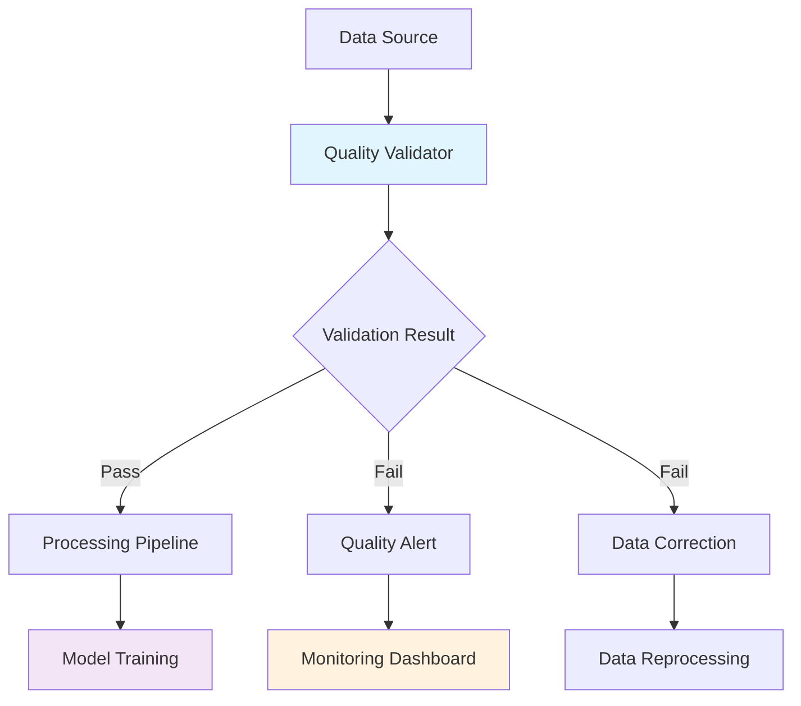
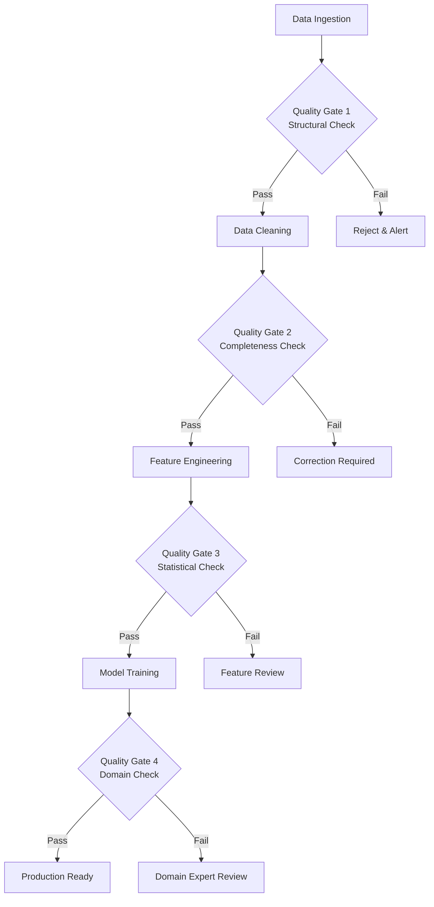
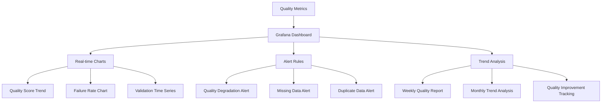

# 🧪 Data Quality Management

## Overview

gogooku3-standalone implements comprehensive data quality management using Great Expectations-inspired validation framework. The system ensures data integrity, consistency, and reliability throughout the ML pipeline.

## Quality Validation Framework

### Core Components



### Quality Checks Categories

#### 1. Structural Validation
- **Schema Compliance**: Required columns, data types, constraints
- **Row Count Validation**: Minimum/maximum thresholds
- **Column Count**: Expected feature dimensions

#### 2. Completeness Validation
- **Missing Data Analysis**: Overall and column-specific ratios
- **Null Value Detection**: Empty strings, NaN values
- **Data Density**: Non-null value percentages

#### 3. Uniqueness Validation
- **Duplicate Detection**: Row-level and column-level duplicates
- **Primary Key Validation**: Date-symbol combination uniqueness
- **Redundancy Analysis**: Highly correlated features

#### 4. Statistical Validation
- **Distribution Analysis**: Mean, std, skewness, kurtosis
- **Outlier Detection**: Statistical and domain-specific bounds
- **Value Range Validation**: Min/max/percentile checks

#### 5. Financial Domain Validation
- **Price Validation**: OHLC relationship verification
- **Volume Validation**: Positive values, realistic ranges
- **Date Continuity**: Trading day sequence validation

#### 6. Correlation Validation
- **Feature Correlation**: Multi-collinearity detection
- **Perfect Correlation**: Duplicate feature identification
- **Correlation Thresholds**: Configurable warning/critical levels

## Implementation

### Quality Validator Class

```python
from data_quality.great_expectations_suite import DataQualityValidator

# Initialize validator
validator = DataQualityValidator()

# Configure thresholds
validator.thresholds = {
    'missing_data_ratio': 0.05,      # 5% max missing
    'duplicate_ratio': 0.01,         # 1% max duplicates
    'correlation_threshold': 0.95    # 95% correlation warning
}

# Validate dataset
result = validator.validate_dataset(df, "training_data")

# Check results
if result.passed:
    print("✅ Data quality validation passed")
    # Proceed with processing
else:
    print("❌ Data quality issues found")
    for issue in result.recommendations:
        print(f"  - {issue}")
    # Handle quality issues
```

### Configuration Options

#### Environment Variables

```bash
# Enable data quality checks
export DATA_QUALITY_ENABLED=1

# Quality thresholds
export DATA_QUALITY_MISSING_RATIO=0.05
export DATA_QUALITY_DUPLICATE_RATIO=0.01
export DATA_QUALITY_OUTLIER_RATIO=0.05
export DATA_QUALITY_CORRELATION_THRESHOLD=0.95
export DATA_QUALITY_MIN_ROWS=100
export DATA_QUALITY_MAX_ROWS=1000000
```

#### Runtime Configuration

```python
# Custom quality checks
custom_checks = {
    'price_validation': lambda df: (df['close'] > 0).all(),
    'volume_validation': lambda df: (df['volume'] > 0).all(),
    'date_sequence': lambda df: df['date'].is_monotonic_increasing
}

validator.add_custom_checks(custom_checks)
```

## Quality Gates

### Pipeline Integration



### Automated Quality Gates

#### Pre-Processing Gate
```python
def pre_processing_gate(df):
    """Validate data before processing."""
    validator = DataQualityValidator()

    # Basic structural checks
    if len(df) < validator.thresholds['min_rows']:
        raise ValueError(f"Insufficient data: {len(df)} rows")

    # Required columns check
    required_cols = ['date', 'symbol', 'close']
    missing_cols = [col for col in required_cols if col not in df.columns]
    if missing_cols:
        raise ValueError(f"Missing required columns: {missing_cols}")

    return validator.validate_dataset(df, "pre_processing")
```

#### Post-Processing Gate
```python
def post_processing_gate(df):
    """Validate processed features."""
    validator = DataQualityValidator()

    # Check feature quality
    result = validator.validate_dataset(df, "post_processing")

    # Additional feature-specific checks
    numeric_cols = df.select_dtypes(include=[np.number]).columns
    if len(numeric_cols) < 10:
        result.recommendations.append("Low feature count - review feature engineering")

    return result
```

## Quality Metrics

### Real-time Monitoring

```python
# Quality metrics for Prometheus
from ops.metrics_exporter import MetricsExporter

exporter = MetricsExporter()

# Export quality metrics
quality_metrics = f"""
# HELP gogooku3_data_quality_score_percent Current data quality score
# TYPE gogooku3_data_quality_score_percent gauge
gogooku3_data_quality_score_percent {result.details.get('overall_score', 95.0)}

# HELP gogooku3_data_validation_checks_total Total validation checks performed
# TYPE gogooku3_data_validation_checks_total counter
gogooku3_data_validation_checks_total {result.total_checks}

# HELP gogooku3_data_validation_failures_total Total validation failures
# TYPE gogooku3_data_validation_failures_total counter
gogooku3_data_validation_failures_total {result.checks_failed}
"""

print(quality_metrics)
```

### Quality Dashboard



## Data Correction Strategies

### Automated Corrections

#### Missing Value Handling
```python
def handle_missing_values(df):
    """Automated missing value correction."""
    # Forward fill for time series data
    df['close'] = df.groupby('symbol')['close'].fillna(method='ffill')

    # Interpolate for technical indicators
    numeric_cols = df.select_dtypes(include=[np.number]).columns
    df[numeric_cols] = df.groupby('symbol')[numeric_cols].fillna(method='linear')

    # Remove rows with critical missing data
    critical_cols = ['date', 'symbol', 'close']
    df = df.dropna(subset=critical_cols)

    return df
```

#### Outlier Treatment
```python
def handle_outliers(df, method='iqr', threshold=1.5):
    """Automated outlier treatment."""
    numeric_cols = df.select_dtypes(include=[np.number]).columns

    for col in numeric_cols:
        if method == 'iqr':
            Q1 = df[col].quantile(0.25)
            Q3 = df[col].quantile(0.75)
            IQR = Q3 - Q1
            lower_bound = Q1 - threshold * IQR
            upper_bound = Q3 + threshold * IQR

            # Cap outliers
            df[col] = df[col].clip(lower_bound, upper_bound)

        elif method == 'zscore':
            from scipy import stats
            z_scores = stats.zscore(df[col])
            df[col] = df[col].mask(np.abs(z_scores) > threshold, df[col].median())

    return df
```

### Manual Review Process

#### Quality Issue Triage
```python
def triage_quality_issues(result):
    """Categorize and prioritize quality issues."""
    issues = {
        'critical': [],
        'warning': [],
        'info': []
    }

    for recommendation in result.recommendations:
        if 'missing' in recommendation.lower():
            issues['critical'].append(recommendation)
        elif 'duplicate' in recommendation.lower():
            issues['warning'].append(recommendation)
        else:
            issues['info'].append(recommendation)

    return issues
```

## Integration Examples

### ML Pipeline Integration

```python
# Integrated quality validation in ML pipeline
def ml_pipeline_with_quality_checks(data_path):
    """ML pipeline with integrated quality checks."""
    # Load data
    df = pd.read_parquet(data_path)

    # Quality gate 1: Pre-processing validation
    pre_result = pre_processing_gate(df)
    if not pre_result.passed:
        logger.error("Pre-processing quality check failed")
        return None

    # Data processing
    processed_df = process_data(df)

    # Quality gate 2: Post-processing validation
    post_result = post_processing_gate(processed_df)
    if not post_result.passed:
        logger.warning("Post-processing quality issues detected")
        # Attempt automated correction
        processed_df = handle_missing_values(processed_df)
        processed_df = handle_outliers(processed_df)

    # Model training
    model = train_model(processed_df)

    return model
```

### CI/CD Integration

```yaml
# .github/workflows/data-quality.yml
name: Data Quality Checks

on:
  push:
    paths:
      - 'data/**'
      - 'data_quality/**'

jobs:
  quality-check:
    runs-on: ubuntu-latest

    steps:
      - uses: actions/checkout@v4

      - name: Set up Python
        uses: actions/setup-python@v4
        with:
          python-version: '3.10'

      - name: Install dependencies
        run: |
          pip install -r requirements.txt
          pip install pandas pyarrow

      - name: Run data quality validation
        run: |
          export DATA_QUALITY_ENABLED=1
          python data_quality/great_expectations_suite.py validate \
            --input data/processed/dataset.parquet \
            --format json > quality-report.json

      - name: Check quality results
        run: |
          QUALITY_SCORE=$(jq '.details.overall_score // 95' quality-report.json)
          if (( $(echo "$QUALITY_SCORE < 90" | bc -l) )); then
            echo "❌ Data quality score too low: $QUALITY_SCORE"
            exit 1
          else
            echo "✅ Data quality acceptable: $QUALITY_SCORE"
          fi

      - name: Upload quality report
        uses: actions/upload-artifact@v3
        with:
          name: data-quality-report
          path: quality-report.json
```

## Best Practices

### Quality Maintenance

1. **Regular Validation**: Run quality checks on all data updates
2. **Threshold Monitoring**: Track quality metrics trends over time
3. **Automated Corrections**: Implement safe automated correction rules
4. **Manual Reviews**: Establish processes for complex quality issues
5. **Documentation**: Maintain quality rules and procedures documentation

### Performance Optimization

1. **Sampling**: Use statistical sampling for large datasets
2. **Caching**: Cache validation results for repeated checks
3. **Parallelization**: Run independent checks in parallel
4. **Incremental Validation**: Validate only changed data portions

### Alert Configuration

```yaml
# Prometheus alert rules for data quality
groups:
  - name: data_quality
    rules:
      - alert: DataQualityScoreLow
        expr: gogooku3_data_quality_score_percent < 90
        for: 5m
        labels:
          severity: warning
        annotations:
          summary: "Data quality score is low"
          description: "Data quality score is {{ $value }}% (threshold: 90%)"

      - alert: DataValidationFailuresHigh
        expr: rate(gogooku3_data_validation_failures_total[1h]) > 5
        for: 10m
        labels:
          severity: warning
        annotations:
          summary: "High rate of data validation failures"
          description: "{{ $value }} validation failures per hour"
```

## Troubleshooting

### Common Issues

#### High Missing Data Ratio
```
Symptoms: missing_data_ratio > 5%
Solutions:
1. Check data source connectivity
2. Review data collection timing
3. Implement data backfilling procedures
4. Update data quality thresholds if appropriate
```

#### Duplicate Records
```
Symptoms: duplicate_ratio > 1%
Solutions:
1. Review data ingestion deduplication logic
2. Check for duplicate data sources
3. Implement primary key constraints
4. Clean historical duplicates
```

#### Outlier Values
```
Symptoms: outlier_ratio > 5%
Solutions:
1. Review outlier detection thresholds
2. Check for data collection errors
3. Implement outlier treatment rules
4. Validate domain-specific value ranges
```

## Metrics and Reporting

### Quality Score Calculation

```python
def calculate_overall_quality_score(result):
    """Calculate overall data quality score."""
    weights = {
        'structure': 0.2,
        'completeness': 0.3,
        'uniqueness': 0.2,
        'statistics': 0.15,
        'financial_domain': 0.1,
        'correlations': 0.05
    }

    score = 0
    for check_name, weight in weights.items():
        if check_name in result.details:
            check_result = result.details[check_name]
            check_score = 100 if check_result.get('passed', False) else 0
            score += check_score * weight

    return score
```

### Automated Reporting

```python
def generate_quality_report(result, output_path):
    """Generate comprehensive quality report."""
    report = {
        'timestamp': pd.Timestamp.now().isoformat(),
        'dataset_name': getattr(result, 'dataset_name', 'unknown'),
        'overall_score': calculate_overall_quality_score(result),
        'passed': result.passed,
        'checks_summary': {
            'total': result.total_checks,
            'passed': result.checks_passed,
            'failed': result.checks_failed
        },
        'recommendations': result.recommendations,
        'detailed_results': result.details
    }

    with open(output_path, 'w') as f:
        json.dump(report, f, indent=2, default=str)

    return report
```

---

## Contact & Support

- **Data Engineering Team**: Data quality framework maintenance
- **ML Engineering Team**: Quality gate integration and monitoring
- **DevOps Team**: CI/CD integration and automated reporting

---

*Last Updated: 2024-01-XX*
*Version: 2.0.0*
*Document Owner: Data Engineering Team*
