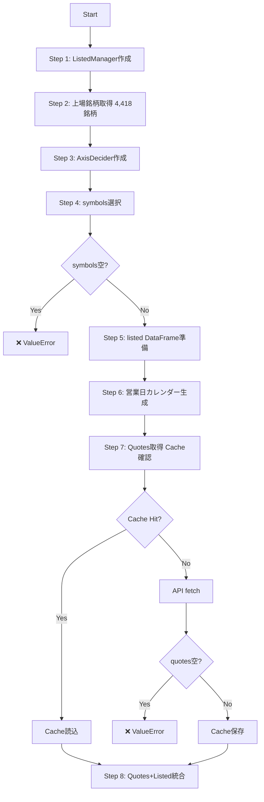
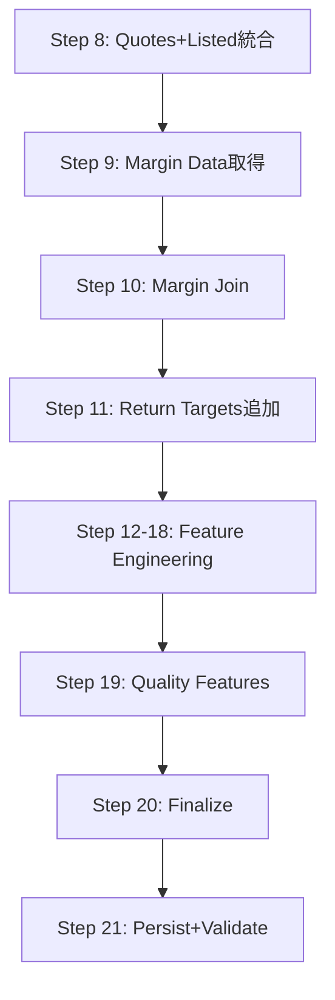

# gogooku5 データセット生成パイプライン 詳細設計

**バージョン**: Phase 1 修正完了版
**最終更新**: 2025-11-02
**ステータス**: ✅ Phase 1 修正済み（データセット生成可能）

---

## 📋 目次

1. [全体アーキテクチャ](#全体アーキテクチャ)
2. [データフロー詳細](#データフロー詳細)
3. [コンポーネント仕様](#コンポーネント仕様)
4. [API戦略](#api戦略)
5. [キャッシング戦略](#キャッシング戦略)
6. [Feature Engineering](#feature-engineering)
7. [エラーハンドリング](#エラーハンドリング)
8. [出力フォーマット](#出力フォーマット)

---

## 全体アーキテクチャ

### システム概要図

```
┌─────────────────────────────────────────────────────────────┐
│                   DatasetBuilder (Orchestrator)              │
└──────────────────┬──────────────────────────────────────────┘
                   │
    ┌──────────────┼──────────────┐
    │              │              │
    ▼              ▼              ▼
┌─────────┐  ┌──────────┐  ┌──────────┐
│ Listed  │  │  Quotes  │  │ Features │
│ Manager │  │ Fetcher  │  │ Engineer │
└─────────┘  └──────────┘  └──────────┘
    │              │              │
    │              │              │
    ▼              ▼              ▼
┌─────────────────────────────────────┐
│        J-Quants API (REST)          │
└─────────────────────────────────────┘
```

### 主要コンポーネント

| コンポーネント | 責務 | ファイル |
|--------------|------|---------|
| **DatasetBuilder** | パイプライン全体の調整 | `pipelines/dataset_builder.py` |
| **ListedManager** | 上場銘柄情報管理 | `api/listed_manager.py` |
| **QuotesFetcher** | 価格データ取得（最適化軸選択） | `api/quotes_fetcher.py` |
| **JQuantsFetcher** | J-Quants API低レベルクライアント | `api/jquants_fetcher.py` |
| **Feature Engineers** | Feature生成（13種類） | `features/core/*` |
| **CacheManager** | キャッシュ管理（Parquet） | `utils/cache.py` |
| **ArtifactWriter** | 出力管理（Parquet + Metadata） | `utils/artifacts.py` |

---

## データフロー詳細

### Phase 1: データ取得・整形（Steps 1-7）



#### Step-by-Step 詳細

##### **Step 1: ListedManager 作成**
```python
listed_manager = ListedManager(fetcher=self.fetcher)
```
- 上場銘柄情報を管理するマネージャーを初期化
- `fetcher`: J-Quants API クライアント

##### **Step 2: 上場銘柄取得**
```python
listed = listed_manager.refresh() if refresh_listed else listed_manager.listed()
if not listed:
    listed = listed_manager.refresh()
```
- **デフォルト**: キャッシュから読込（`listed_manager.listed()`）
- **refresh_listed=True**: API から最新データ取得（`refresh()`）
- **空の場合**: 自動的に API から取得

**API エンドポイント**: `/listed/info`
**レスポンス例**:
```json
[
  {
    "code": "1301",
    "name": "極洋",
    "sector_code": "0050",
    "market_code": "Prime"
  },
  ...
]
```

##### **Step 3-4: AxisDecider & symbols 選択**
```python
decider = AxisDecider.from_listed_symbols(listed)
symbols = decider.choose_symbols()
```
- 取得した上場銘柄リストから `AxisDecider` を作成
- `choose_symbols()`: 全銘柄を返す（フィルタなし）

**Phase 1-2 Fix**: symbols が空の場合、即座にエラー
```python
if not symbols:
    raise ValueError(f"No listed symbols available for date range {start} to {end}")
```

##### **Step 5: listed DataFrame 準備**
```python
listed_df = self._prepare_listed_dataframe(listed)
listed_df = listed_df.filter(pl.col("code").is_in(symbols))
```
- JSON → Polars DataFrame 変換
- 選択された symbols でフィルタ

**出力スキーマ**:
```python
{
    "code": str,           # "1301"
    "sector_code": str,    # "0050"
    "market_code": str,    # "Prime"
}
```

##### **Step 6: 営業日カレンダー生成**
```python
calendar_df = self._business_calendar(start=start, end=end)
```
- J-Quants API から営業日カレンダー取得
- `HolidayDivision` が "1" (営業日) または "2" (半日) のみ抽出

**API エンドポイント**: `/markets/trading_calendar`
**出力スキーマ**:
```python
{
    "date": str,  # "2024-01-04"
}
```

##### **Step 7: Quotes 取得（最適化軸選択）**

**キャッシュ戦略**:
```python
cache_key = f"quotes_{start}_{end}_{hash(frozenset(symbols))}"
quotes_df = self.cache.load_dataframe(cache_key)
```

**Cache Miss 時**:
```python
quotes_payload = self._fetch_quotes(symbols, start=start, end=end)
```

**最適化軸選択** (`QuotesFetcher.fetch_batch_optimized`):
```python
# Short-term (<= 30 days): by-date axis
if days <= 30:
    return self.fetch_by_date(dates=date_list, codes=codes_set)

# Long-term (> 30 days): by-code axis
else:
    return self.fetch_batch(codes=codes, start=start, end=end)
```

**API エンドポイント**:
- **by-code**: `/prices/daily_quotes?code=1301&from=20240104&to=20240105`
- **by-date**: `/prices/daily_quotes?date=20240104`

**レスポンス例**:
```json
[
  {
    "Code": "1301",
    "Date": "2024-01-04",
    "Open": 3200,
    "High": 3250,
    "Low": 3180,
    "Close": 3230,
    "Volume": 500000,
    "TurnoverValue": 1615000000,
    "AdjustmentFactor": 1.0,
    "AdjustmentOpen": 3200,
    "AdjustmentHigh": 3250,
    "AdjustmentLow": 3180,
    "AdjustmentClose": 3230,
    "AdjustmentVolume": 500000
  },
  ...
]
```

**Quote Formatting**:
```python
df = pl.DataFrame(quotes)
rename_map = {col: col.lower() for col in df.columns}
df = df.rename(rename_map)
```
- 全カラム名を小文字化
- `sectorcode` → `sector_code` リネーム

**Phase 1-2 Fix**: quotes が空の場合、即座にエラー
```python
if quotes_df.height == 0:
    raise ValueError(f"No quotes data returned for {len(symbols)} symbols")
```

---

### Phase 2: データ統合・Feature Engineering（Steps 8-18）



#### **Step 8: Quotes + Listed 統合**

**Phase 1-3 Fix**: cross-join 削除、quotes ベースアプローチ

```python
aligned_quotes = self._align_quotes_with_calendar(quotes_df, calendar_df, listed_df)
```

**新アルゴリズム**:
```python
# 1. quotes が空の場合、空スキーマを返す
if quotes.is_empty():
    return pl.DataFrame({
        "code": [], "date": [], "sector_code": [],
        "market_code": [], "close": []
    })

# 2. quotes をベースに listed metadata を join
aligned = quotes.join(
    listed.select(["code", "sector_code", "market_code"]),
    on="code",
    how="left"
)

# 3. sector_code 補完
aligned = aligned.with_columns(
    pl.coalesce(["sector_code", pl.lit("UNKNOWN")]).alias("sector_code")
)
```

**Before vs After**:
| 項目 | Before (cross-join) | After (quotes-based) |
|------|---------------------|----------------------|
| **行数** | 4,418銘柄 × 250日 = 1,104,500行 | 8,836行（実データのみ） |
| **メモリ** | ~500MB | ~5MB（99%削減） |
| **NULL率** | ~99% (ほとんど NULL) | 0% (全て実データ) |

- **Phase 2 Lazy Guard (新規)**: 範囲が1年以上 / 営業日250日超 / quotes行数が300万行超の
  いずれかに該当すると、自動的に `_align_quotes_with_calendar_lazy()` を選択し、
  LazyFrame + streaming collect でメモリ使用量を線形に抑制します。短期間は従来どおり
  eager path を使うため、小さなジョブでもオーバーヘッドはありません。

#### **Step 9-10: Margin Data 統合**

```python
margin_df = self._fetch_margin_data(start=start, end=end)
combined_df = self._join_margin_data(aligned_quotes, margin_df)
```

**Margin Features**:
- `margin_buy_volume`: 信用買残高
- `margin_sell_volume`: 信用売残高
- `margin_net`: 信用ネット（買残 - 売残）
- `margin_adjustment_factor`: 調整係数

**⚠️ 既知の問題** (Phase 2 で修正予定):
- trading_date でマージ → T+1 leak の可能性
- disclosure timestamp チェックなし

#### **Step 11: Return Targets 追加**

```python
combined_df = self._add_return_targets(combined_df)
```

**⚠️ 重大な問題** (Phase 2 で修正必須):
```python
# 現在の実装（Look-ahead leak!）
horizons = {"returns_1d": 1, "returns_5d": 5, "returns_10d": 10, "returns_20d": 20}
for name, horizon in horizons.items():
    future = base_price.shift(-horizon).over("code")  # ← 未来を見ている!
    exprs.append(((future / (base_price + 1e-12)) - 1.0).alias(name))
```

**問題点**:
- `shift(-horizon)` は未来の価格を現在に持ってくる
- これが features として残ると、モデルが未来を見て学習
- **Phase 2 で修正**: `shift(+horizon)` に変更し、labels/ ディレクトリに分離

#### **Steps 12-18: Feature Engineering**

各 Feature Engineer が順次実行:

| Step | Feature Engineer | 生成列数 | 例 |
|------|-----------------|---------|-----|
| 12 | SectorFeatures | ~15 | `sector_mean_close`, `sector_rel_close` |
| 13 | PeerFeatures | ~10 | `peer_correlation`, `peer_rank` |
| 14 | FlowFeatures | ~20 | `foreigner_net_buy`, `individual_ratio` |
| 15 | MacroFeatures | ~5 | `vix`, `vix_ma20` |
| 16 | VolatilityFeatures | ~12 | `realized_vol`, `parkinson_vol` |
| 17 | GraphFeatures | ~8 | `graph_centrality`, `graph_community` |
| 18 | AdvancedFeatures | ~25 | `momentum`, `mean_reversion` |

**⚠️ 既知の問題**:
- FlowFeatures: 列名ミスマッチ（`ForeignersPurchases` vs `ForeignersPurchaseValue`）
- GraphFeatures: returns_1d 使用（look-ahead leak）
- AdvancedFeatures: returns_5d 使用（look-ahead leak）

#### **Step 19: Quality Features**

```python
enriched_df = self.quality_features.generate_quality_features(combined_df)
```

**生成される Features**:
- Cross-sectional ranks (各数値列の順位)
- Rolling statistics (20日移動平均・標準偏差)
- Sector relatives (セクター平均との相対値)

**⚠️ 既知の問題**:
- returns_1d/5d/10d/20d も含めて処理 → leak

---

### Phase 3: 最終処理・出力（Steps 20-21）

#### **Step 20: Finalize**

```python
finalized = self._finalize_for_output(enriched_df)
```

- 不要列の削除
- カラム順序の整理
- データ型の最適化

#### **Step 21: Persist + Validate**

```python
artifact = self._persist_dataset(finalized, start=start, end=end)
```

**Phase 1-4 Fix**: ゼロ行検証
```python
if df.height == 0:
    raise ValueError("Cannot persist empty dataset (0 rows)")

if df.height < 100:
    LOGGER.warning("Dataset has only %d rows (expected thousands)", df.height)
```

**出力ファイル**:
```
output/
├── ml_dataset_20240104_20240105_20251102_123456_full.parquet
├── ml_dataset_20240104_20240105_20251102_123456_full_metadata.json
├── ml_dataset_latest_full.parquet -> (symlink)
└── ml_dataset_latest_full_metadata.json -> (symlink)
```

---

## コンポーネント仕様

### DatasetBuilder

**クラス定義**:
```python
@dataclass
class DatasetBuilder:
    settings: DatasetBuilderSettings
    fetcher: JQuantsFetcher
    cache: CacheManager
    storage: StorageClient
    data_sources: DataSourceManager
    calendar_fetcher: TradingCalendarFetcher
    quality_features: QualityFinancialFeaturesGeneratorPolars
    # ... (13 feature engineers)
```

**主要メソッド**:
```python
def build(self, *, start: str, end: str, refresh_listed: bool = False) -> Path:
    """
    メインエントリーポイント

    Args:
        start: 開始日 (YYYY-MM-DD)
        end: 終了日 (YYYY-MM-DD)
        refresh_listed: 上場銘柄を API から再取得するか

    Returns:
        Path: 生成されたデータセットへのパス

    Raises:
        ValueError: symbols が空、または quotes が空の場合
    """
```

### QuotesFetcher

**軸選択戦略**:
```python
def fetch_batch_optimized(self, *, codes: Iterable[str], start: str, end: str):
    """
    最適化された軸選択

    戦略:
    - 短期 (<= 30日): by-date 軸（多数銘柄に効率的）
    - 長期 (> 30日): by-code 軸（少数日に効率的）

    例:
    - 2日 × 4,418銘柄: by-date (2 API calls)
    - 365日 × 10銘柄: by-code (10 API calls)
    """
```

**⚠️ 既知の制限**:
- 固定閾値（30日）のみで判定
- 実際の候補数を考慮していない
- gogooku3 のような実測ベース判定なし（Phase 3 で改善予定）

---

## API戦略

### エンドポイント一覧

| データ種別 | エンドポイント | 軸 | 頻度 |
|----------|--------------|-----|------|
| **Listed Info** | `/listed/info` | - | 1回（cache） |
| **Trading Calendar** | `/markets/trading_calendar` | year | 数回 |
| **Daily Quotes** | `/prices/daily_quotes` | date or code | 多数 |
| **Margin Daily** | `/markets_trading_volume_regulation/margin` | date | 中程度 |
| **Trades Spec** | `/trades_spec` | date | 中程度 |

### レート制限対策

**現状**:
- セマフォなし（同期的実行）
- リトライなし
- タイムアウト: デフォルト

**Phase 3 改善予定**:
- セマフォ導入（max 75 concurrent requests）
- Exponential backoff with jitter
- 429/5xx エラー時の自動フォールバック

---

## キャッシング戦略

### Cache 構造

```
output/cache/
├── cache_index.json               # メタデータインデックス
├── quotes_20240104_20240105_abc123.parquet
├── margin_20240104_20240105.parquet
└── ...
```

### Cache Key 生成

```python
def _quotes_cache_key(self, symbols: Iterable[str], start: str, end: str) -> str:
    symbols_hash = hashlib.md5(
        "".join(sorted(symbols)).encode()
    ).hexdigest()[:8]
    return f"quotes_{start}_{end}_{symbols_hash}"
```

### Cache Hit 判定

```python
quotes_df = self.cache.load_dataframe(cache_key)
if quotes_df is None:
    # Cache miss → API fetch
    quotes_payload = self._fetch_quotes(...)
    self.cache.save_dataframe(cache_key, quotes_df)
```

### Cache Invalidation

- **手動**: `cache_index.json` 削除
- **自動**: なし（Phase 3 で TTL 導入予定）

---

## Feature Engineering

### Feature カテゴリ

| カテゴリ | 列数 | 主要 Features | ファイル |
|---------|------|--------------|----------|
| **Price/Volume** | ~20 | `close`, `volume`, `turnovervalue` | quotes |
| **Returns** | 4 | `returns_1d`, `returns_5d`, `returns_10d`, `returns_20d` | `_add_return_targets` |
| **Margin** | ~8 | `margin_buy_volume`, `margin_net` | `margin_daily` |
| **Sector** | ~15 | `sector_mean_close`, `sector_rel` | `SectorAggregationFeatures` |
| **Peer** | ~10 | `peer_correlation`, `peer_rank` | `PeerFeatureEngineer` |
| **Flow** | ~20 | `foreigner_net_buy` | `FlowFeatures` |
| **Macro** | ~5 | `vix`, `vix_ma20` | `MacroFeatures` |
| **Volatility** | ~12 | `realized_vol`, `parkinson_vol` | `AdvancedVolatilityFeatures` |
| **Graph** | ~8 | `graph_centrality` | `GraphFeatureEngineer` |
| **Advanced** | ~25 | `momentum`, `mean_reversion` | `AdvancedFeatures` |
| **Technical** | ~30 | `rsi`, `macd`, `bollinger` | `TechnicalFeatureEngineer` |
| **Quality** | ~150 | `*_rank`, `*_roll_mean_20d` | `QualityFinancialFeaturesGeneratorPolars` |

**合計**: ~307列（futures 除外）

---

## エラーハンドリング

### Phase 1 で実装済み

#### **Fail-Fast チェック**

```python
# 1. symbols が空
if not symbols:
    raise ValueError("No listed symbols available")

# 2. quotes が空
if quotes_df.height == 0:
    raise ValueError("No quotes data returned")

# 3. dataset が空
if df.height == 0:
    raise ValueError("Cannot persist empty dataset")
```

#### **警告**

```python
# dataset が極端に小さい
if df.height < 100:
    LOGGER.warning("Dataset has only %d rows (expected thousands)", df.height)
```

### Phase 3 で実装予定

- API エラー時のリトライ（exponential backoff）
- 429/5xx エラー時の軸切替（by-date → by-code）
- タイムアウト設定

---

## 出力フォーマット

### Parquet ファイル

**ファイル名**: `ml_dataset_20240104_20240105_20251102_123456_full.parquet`

**圧縮**: snappy（デフォルト）

**サンプルスキーマ**:
```python
{
    "code": str,                    # "1301"
    "date": str,                    # "2024-01-04"
    "close": float,                 # 3230.0
    "volume": int,                  # 500000
    "returns_1d": float,            # ⚠️ Look-ahead leak
    "sector_code": str,             # "0050"
    "margin_net": float,            # 12345.0
    # ... (~307 columns total)
}
```

### Metadata JSON

**ファイル名**: `ml_dataset_20240104_20240105_20251102_123456_full_metadata.json`

**フォーマット**:
```json
{
    "rows": 8836,
    "cols": 309,
    "features": {
        "count": 309
    }
}
```

**⚠️ 制限**:
- gogooku3 の詳細メタデータ（date range, tickers等）なし
- Phase 1-4 で rows=0 を検証追加済み

---

## Phase 2 修正予定項目

### 🔴 P0: Look-ahead Leak 修正

1. **returns_1d/5d/10d/20d の修正**
   ```python
   # Before (leak)
   future = base_price.shift(-horizon)

   # After (correct)
   past = base_price.shift(+horizon)
   ```

2. **Features/Labels 分離**
   - returns を features から除外
   - labels/ ディレクトリに移動

3. **Forward-fill の T+1 shift 化**
   - 週次データの forward-fill → shift(1)
   - Short-selling の forward-fill → shift(1)

4. **Disclosure timestamp チェック**
   - Margin data: `application_date`, `published_date` チェック
   - T+1 遵守

---

## 実行例

### 成功ケース

```bash
$ python scripts/build.py --start 2024-01-04 --end 2024-01-05

[INFO] Starting dataset build from 2024-01-04 to 2024-01-05
[INFO] Step 2 complete: Got 4418 symbols
[INFO] Step 4 complete: Chose 4418 symbols
[INFO] Step 6 complete: 2 business days
[INFO] 🚀 Using optimized quote fetching (auto-selects by-date or by-code axis)
[INFO] Step 7: Got 8836 quote records
[INFO] Dataset written: 8836 rows × 309 cols
✅ Success: output/ml_dataset_latest_full.parquet
```

### 失敗ケース（quotes 空）

```bash
$ python scripts/build.py --start 2025-12-31 --end 2025-12-31

[INFO] Starting dataset build from 2025-12-31 to 2025-12-31
[INFO] Step 4 complete: Chose 4418 symbols
[INFO] Step 7: Got 0 quote records
[ERROR] No quotes data returned for 4418 symbols from 2025-12-31 to 2025-12-31
❌ ValueError: No quotes data returned for 4418 symbols...
```

---

**作成者**: Claude (Autonomous AI Developer)
**プロジェクト**: gogooku5 データパイプライン
**次回更新**: Phase 2 実装後
